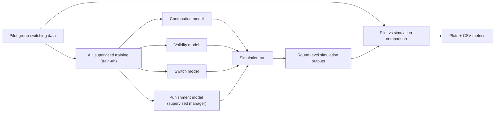

# [DONE] Issue #45: Group Switching Simulation + Validation

## Scope and Decisions
- Use **supervised AH training pipeline** for the manager punishment model (behavioral cloning style), not RL manager training.
- Keep simulation stack aligned with issue comment artifacts:
  - contribution model: `artifacts/artificial_humans/group_switching_contribution/`
  - switch model: `artifacts/artificial_humans/switch_pred_mlp_rnn/`
  - validity model (legacy): `artifacts/artificial_humans/raven_script_22/`
- Deliverables:
1. ah punishment model
2. comparison of simulation results with all the new models against the pilot data, comparison metrics/plots for contributions, switching, group sizes, post-switch adaptation, and punishment patterns.
- All training/simulation runs are executed on Raven via the repo skills (`/train`, `/simulate`) that call cluster scripts, not as local Python runs.
- Cluster artifacts are pulled locally for inspection via the `/fetch-cluster` skill.

## Implementation Plan

### 1) Add a first-class supervised punishment-manager training config (AH pipeline)
- Add a config under `configs/training/artificial_humans/` for punishment prediction using pilot/group-switching data.
- Configure model target/mask for punishment prediction (equivalent to behavioral-cloning runs in `run/behavioral_cloning/` but migrated into modern `train-ah` config structure).
- Reuse existing AH training entrypoint (`python -m aimanager train-ah <config>`) through cluster submission with the training skill:
  - `/train ah <config>`
  - underlying command: `scripts/train_cluster.sh ah <config>`
- Model after the legacy config at `run/behavioral_cloning/11_punishment_autoregressive.yml` while changing the training data to up to date `data_file: experiments/group_switching_human_human_group_switching_8_agents.csv`.

Status: **DONE**
- Added config: `configs/training/artificial_humans/punishment/autoregressive.yml`.
- Executed on Raven via `/train ah configs/training/artificial_humans/punishment/autoregressive.yml`.
- Final successful run used `n_cross_val: 5` and produced artifacts under:
  - `artifacts/artificial_humans/punishment_autoregressive/`
  - `.log/training/artificial_humans/punishment/autoregressive/architecture_node+edge+autoregressive__dataset_full/`
- Metrics summary (mask=0): test `log_loss` converged from `3.467` to `1.226` (best mean `1.170`), which is sufficient to mark Step 1 complete.

Primary files:
- [src/aimanager/artificial_humans/train.py](/Users/cemerturkan/Desktop/mpi/mpi-projects/algorithmic-institutions/src/aimanager/artificial_humans/train.py)
- [src/aimanager/generic/data.py](/Users/cemerturkan/Desktop/mpi/mpi-projects/algorithmic-institutions/src/aimanager/generic/data.py)
- [configs/training/artificial_humans/](/Users/cemerturkan/Desktop/mpi/mpi-projects/algorithmic-institutions/configs/training/artificial_humans)
- [run/behavioral_cloning/23_punishment_autoregressive_v4.yml](/Users/cemerturkan/Desktop/mpi/mpi-projects/algorithmic-institutions/run/behavioral_cloning/23_punishment_autoregressive_v4.yml)

### 2) Wire simulation config to artifact set from issue comment
- Update group-switching simulation config(s) to point to the exact artifact paths from issue #45 comment.
- Ensure the manager entry is `type: human` and references the supervised punishment model artifact, not RL.
- Keep current switching cadence/round structure unless issue acceptance criteria says otherwise.

Status: **DONE**
- Added dedicated AH testing config:
  - `configs/simulation/ah_testing/group_switching_ah_punishment.yml`
- Added RL baseline companion config:
  - `configs/simulation/ah_testing/group_switching_rl_punishment.yml`
- Wired issue #45 artifact set:
  - contribution: `artifacts/artificial_humans/group_switching_contribution/...`
  - switch: `artifacts/artificial_humans/switch_pred_mlp_rnn/...`
  - validity: `artifacts/artificial_humans/raven_script_22/...`
- Human manager path:
  - `artifacts/artificial_humans/punishment_autoregressive/model/architecture_node+edge+autoregressive__dataset_full.pt`

Primary files:
- [configs/simulation/ah_testing/group_switching_ah_punishment.yml](/Users/cemerturkan/Desktop/mpi/mpi-projects/algorithmic-institutions/configs/simulation/ah_testing/group_switching_ah_punishment.yml)
- [configs/simulation/ah_testing/group_switching_rl_punishment.yml](/Users/cemerturkan/Desktop/mpi/mpi-projects/algorithmic-institutions/configs/simulation/ah_testing/group_switching_rl_punishment.yml)
- [src/aimanager/manager/api_manager.py](/Users/cemerturkan/Desktop/mpi/mpi-projects/algorithmic-institutions/src/aimanager/manager/api_manager.py)

### 3) Fix simulation-group assignment consistency during switching
- Validate and patch simulation so manager inputs use **current** dynamic group assignment from env state after switches, not static initial grouping.
- Confirm this flows correctly into punishment generation each decision round.

Status: **DONE**
- Initial simulation run failed with:
  - `KeyError: 'agent_group'` in manager inference.
- Root cause:
  - `agent_group` was not passed through round records and manager data tensors.
- Fix implemented:
  - `src/aimanager/simulation/simulate.py`: include current `state["agent_group"]` in `make_round(...)`.
  - `src/aimanager/manager/api_manager.py`: add `agent_group` to `Round` and `create_data(...)`.
- Validation:
  - rerun completed and produced:
    - `plots/simulation/ah_group_switching_punishment/comparison_manager.jpg`
    - `plots/simulation/ah_group_switching_punishment/comparison_pilot.jpg`
    - `plots/simulation/ah_group_switching_punishment/ah_group_switching_managed_by_punishment_human_manager_groups.png`
    - `plots/simulation/ah_group_switching_punishment/aggregates.csv`

Primary files:
- [src/aimanager/simulation/simulate.py](/Users/cemerturkan/Desktop/mpi/mpi-projects/algorithmic-institutions/src/aimanager/simulation/simulate.py)
- [src/aimanager/manager/environment.py](/Users/cemerturkan/Desktop/mpi/mpi-projects/algorithmic-institutions/src/aimanager/manager/environment.py)

### 4) Add reproducible validation outputs against pilot data
- Build/extend a script or notebook-backed runner that computes parity metrics between simulated and real data:
  - contribution trajectories over rounds
  - switching rate/timing
  - group-size evolution
  - post-switch adaptation
  - punishment patterns
- Save both tabular outputs (CSV) and plots in a dedicated output directory.

Primary files:
- [experiment_analysis/exp2_data_analysis.py](/Users/cemerturkan/Desktop/mpi/mpi-projects/algorithmic-institutions/experiment_analysis/exp2_data_analysis.py)
- [experiment_analysis/switching_analysis.py](/Users/cemerturkan/Desktop/mpi/mpi-projects/algorithmic-institutions/experiment_analysis/switching_analysis.py)
- [notebooks/test_manager/simulate_mixed_comparison.ipynb](/Users/cemerturkan/Desktop/mpi/mpi-projects/algorithmic-institutions/notebooks/test_manager/simulate_mixed_comparison.ipynb)

### 5) Add minimal regression tests for switching + human manager path
- Add/extend tests to ensure:
  - switch events update effective group membership as expected
  - manager punishment inference uses switched memberships
  - output schema includes required fields for downstream validation metrics

Primary files:
- [src/aimanager/tests/test_environment.py](/Users/cemerturkan/Desktop/mpi/mpi-projects/algorithmic-institutions/src/aimanager/tests/test_environment.py)
- [src/aimanager/simulation/simulate.py](/Users/cemerturkan/Desktop/mpi/mpi-projects/algorithmic-institutions/src/aimanager/simulation/simulate.py)

### 6) Execute runs via cluster skills and capture reproducible run metadata
- Use `/train` and `/simulate` skill commands for all heavy runs:
  - training: `/train ah <training_config>`
  - simulation: `/simulate <simulation_config>`
- Fetch remote outputs for local inspection with `/fetch-cluster <remote_path> [local_destination]`:
  - model artifacts: `/fetch-cluster artifacts/artificial_humans/<run_dir>/`
  - simulation outputs: `/fetch-cluster artifacts/simulations/<run_dir>/`
  - targeted sync for analysis: `/fetch-cluster <remote_results_dir> ./artifacts/inspection/<label>/`
- Use sync modes intentionally:
  - first run in a session: default sync behavior
  - quick reruns: `--no-sync` when code/configs are unchanged
  - infra check only: `--sync-only`
- If SSH pre-check fails, start ControlMaster first by running `ssh raven` in a separate terminal, then rerun the skill command (`/train`, `/simulate`, or `/fetch-cluster`).
- Record submitted job IDs, config paths, remote artifact directories, and fetched local paths in plan notes/PR comments for reproducibility.

## Dataflow (Target)

## Acceptance Criteria
- Supervised punishment-manager training config exists and can be launched on Raven via `/train ah <config>`.
- Group-switching simulation config uses artifact paths from issue #45 comment.
- Simulation manager inputs reflect switched group memberships over time.
- Comparison artifacts include all 5 requested dynamics families and are saved reproducibly.
- Basic tests cover switching + manager integration path.
- End-to-end training/simulation/fetch execution instructions are skill-based (`/train`, `/simulate`, `/fetch-cluster`) and cluster-ready.

## References
- Issue: [Simulate human groups with switching and validate against real data #45](https://github.com/center-for-humans-and-machines/algorithmic-institutions/issues/45)
- Issue comment artifacts source: same issue comment thread.
