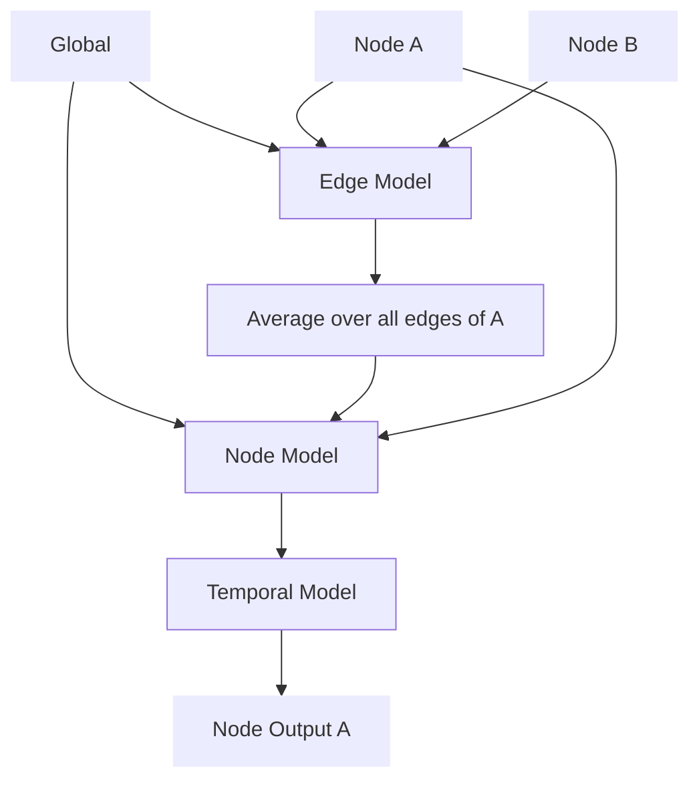

# Artificial Humans

We train 'artificial humans' that are predicting the next contribution based on historic contributions and punishments of all participants in a group. 

## Neural architecture

## Inputs

|   | Global  | Node  |
|---|---|---|
| Group Member | previous common good    round number | previous contributions   previous punishments    previous valid contribution |
| Manager | previous common good    round number | contributions   previous punishments    previous valid punishment |

