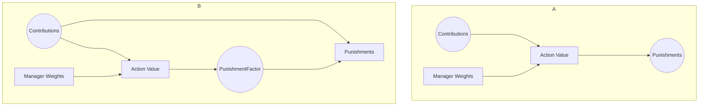
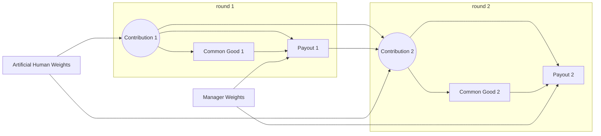
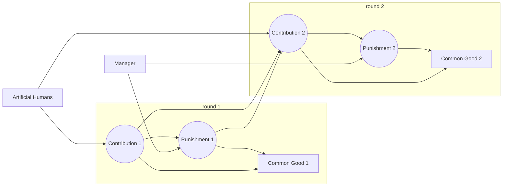
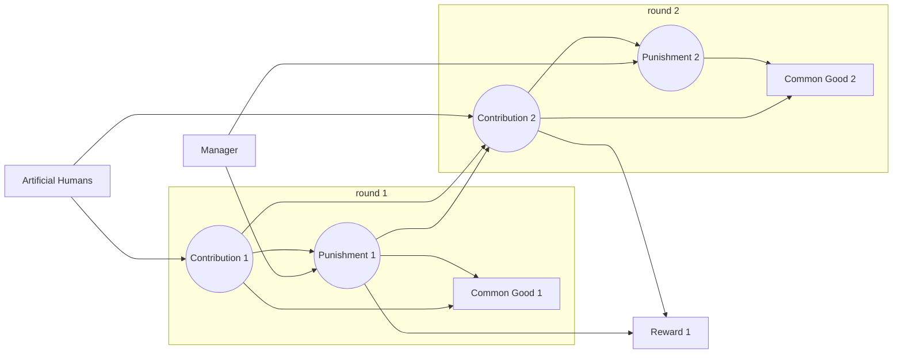
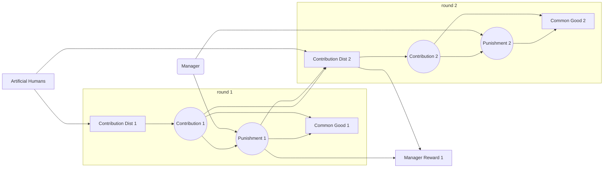

# Revisit Experimental setup

## Game

Four contributor and a manager are forming a group. Each group is playing 16
rounds. At the beginning of the round contributors receive 20 points from the
bank into their private account. Contributors can pay from 0 up to 20 points
into a common pool. The common pool is multiplied by a factor of 1.6. The
manager can punish individual contributors with from 0 up to 30 points. The
punishment is deducted from the contributors private account. Additionally the
punishment is deducted form the common pool. This renders punishments costly for
everyone. At the end of the round the common pool is splitted equally between
the contributors independently of their payments and added to their respective
private accounts. The contributors get a payout proportionally
to their private accounts. The manager is receiving a payout proportionally to
the common pool.

## Pilot Data

### Pilot 1 - Human Manager

We collected ~80 episodes a 8 rounds with a human manager. In this setup a group
would be playing in two episode with the manager changing.

### Pilot 2 - Rule Based Manager

We collected ~45 episodes a 16 rounds with a rule based manager.

In pilot two we utilized a rule to determine the punishments. The rule has the form:
$$pun = (20-cont) \cdot s + (cont != 20) \cdot  c - b$$

The factors s,c and b were distinct for each contributor and round. However,
they were sampled from a multivariate normal distribution ensuring correlation
over the rounds as well as a correlation between rounds.

## Models

### Artificial Humans

We used supervised deep learning to create a model of artificial humans. The
artificial humans are train on pilot 1 and 2.

**Simple Artificial Humans**

Inputs

- previous contribution
- previous punishment
- previous valid

Simple two layer neural network architecture.

**Complex Artificial Humans**

Inputs

- previous contribution
- previous punishment
- previous valid
- previous common good

Graph neural network architecture to learn social influence and RNN to learn
temporal relationships.

### Artificial Human Manager

We used supervised deep learning to create a model of artificial human manager. The
artificial human manager are train on pilot 1 only.

### Optimal Manager

We intend to train an optimal manager using reinforcement learning, that
maximize the common good of a group of artificial humans.

# RL manager

# Rule Manager

## Rule

$pun = (20-cont) \cdot s + (cont != 20) \cdot  c - b$

## Importance of factors

### Slope and constant punishment of defects

### Slope and constant forgiveness

### Conclusion

- Slope is the most important factor.
- Therefore we set in the following c == 0 and b == 0.
- A slope around 1.2 appears optimal for the complex AH.
- For simple AH there does not appear to a clear maximum.

## Evolution over the rounds

### Contribution and punishments over rounds

This plot shows the evolution of contributions and punishments over 16 rounds.

### Common Good and Cumulative Common Good

## Applying the rule only partially

### Apply the rule only to 1,2,3,4 agents

### Apply the rule only to some rounds - Total over episode

### Apply the rule only to some rounds - Per round

## RL Manager

### Sampling

Currently I am using an epsilon greedy sampling approach. Thereby 10% of
all individual punishment are sampled at random. Thereby I am assuming
independence between agents and independence between rounds. That means, there
is no correlation in the sampling of random actions between the four group
members. There is also no correlation in the sampling of random actions in the
16 rounds. Naturally, there is also no correlation between the contribution
and the randomly sampled actions.

Taken together, exploration might be very slow, if multiple actions need to come
together in order to gain a positive outcome.

Next steps

- massively increase sampling?
- sampling smarter?

### Output

We compare two different ways to formulate the problem. A direct policy (A) is
directly determining the punishment given a contribution. Alternatively, the
policy could control a factor (Punishment factor), that multiplied with the
contribution results in a punishment.

Pro Direct (A)

- Higher generalizability
- Simpler Architecture

Pro Factor (B)

- Random exploration is in terms of slope
- Faster sampling of

### Deepmind Approach

In the Deepmind paper, the game is slightly different. Group member contribute
to the common pool. Then the "mechansim" is deciding how the common pool is
split and payed back to the group member.

**Stochastic Computation Graph**

**Surrogate Loss**

> SCG framework generalizes the policy gradient theorem and allowed us to obtain a low-variance estimator of the policy gradient by auto-differentiating through the environment and mechanism policy, while compensating for the non-differentiable operations (the discrete contributions of the players).

$$
L = J + \bot (J) \times \sum_{i} \sum_{t=2}^{10} logp(\bot(c_i^t))
$$

$J$: actual objective; $\bot$: stop gradient; $i$: contributor idx; $t$: round
number; $c$: contribution

### Applying SCG to our setup?

**General Setup**

**Reformulating Reward**

####

# Main Questions

## DQN or Policy Gradient?

Which RL method to use?

## DQN parameter

- One update step every episode
- learning rate: 0.003
- Optimizer: RMSprop
- epsilon: 0.1
- update frequency of target policy: every 20 episodes
- Size of replay memory: 1000
- Batch Size: 20
- Number of episodes: 10000

## Next steps

- Changing method or further debugging?
- Parallelize environment (sampling in batches)
