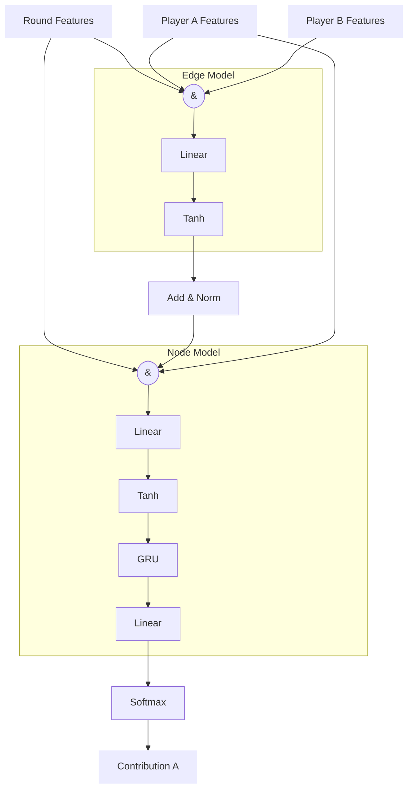
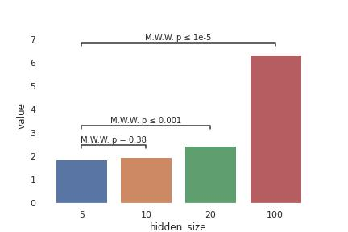
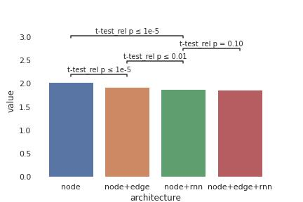
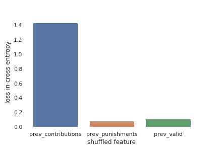
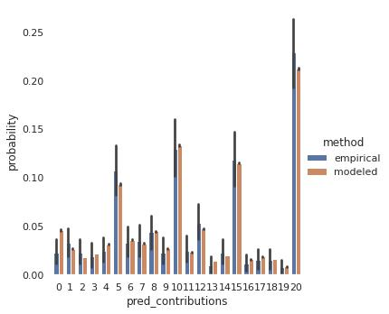
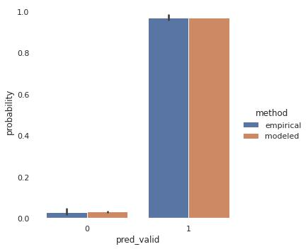

# Artificial Humans

We train 'artificial human contributors' (AHC) that are predicting behavior of
human participants based on historic contributions and punishments of all
participants in a group. The AHC are modeled with neural networks which
architecture we are describing in the following in greater detail. In each
round, we predict a multinominal distribution over the 21 possible contributions
for each of the 4 group members. We optimize the model on the cross-entropy
loss. Cases in which participants do not enter a contribution are masked and do
not enter the loss.

We investigated formulating the problem as a regression instead of a classification. However, shrinkage resulted in missing out on the extremes (i.e. contributions of 0 or 20). Also predicting contributions as point values does not allow to capture mixed strategies, i.e. cases in which participants in a given situation randomly decide between different contributions.

We train the models using an Adam Optimizer with a learning rate of 0.003. Gradients are clamped at absolute 1 and weights are regulized with a decay of 1.e-4. We train batches of 10 groups and full episodes.

We distinguish between two different types of features. Round features, i.e.
round number and common good, are identically for all members in the group.
Individual features, i.e. contributions and punishments, are different between
the group members. All inputs are scaled in the range 0 to 1.

## Neural architecture

We structure our model in three parts following recent work on graph networks
{Relational inductive biases, deep learning, and graph networks}. Thereby we
describe the group as a fully connected graph of four nodes. Our architecture
design was guided by ensuring permutation symmetry in the relationship between
individuals. Furthermore, we included GRUs to allow for learning temporal
relationships. By placing the GRUs after aggregating pairwise interactions, we
assume that temporal relationships are relevant on the global and individual
level, but not at the level of pairwise relationships. The model receives global
(round number and previous common good) and node features (previous contribution
and received punishment). No explicit edge features are provided.

An edge model is applied to each of the 16 combinations of nodes (considering
order), reflecting the 12 directed edges of the fully connected graph. For each
edge, the global features are concatenated with the node features of the node
pair. The resulting vector is then passed through a single layer perceptron. All
resulting vectors from the same source node are averaged to a single vector.

A node model is applied to each of the 4 nodes. The output of the edge model is
concatenated with the global and the node features. The resulting vector is then
passed through a single layer perceptron. The perceptron is followed by a gated
recurrent unit and final linear layer, which then after applying a softmax
operation outputs the distribution over the 21 possible contribution levels.

We use for all linear layers (except the last layer) and the GRU the same number of output units, which we denote as 'hidden units' in the following.

## Evaluation

For all evaluations in the following, we report (if applicable) averages on
cross-validated test sets (k=10). Thereby always a complete group (and their full
episode) is randomly assigned to one of the six folds, to prevent correlation
between folds.

### Features

As input we include the `previous contribution` and the
`previous punishment` of each group member. When the corresponding human
in the pilot did not entered a contribution or punishment we imputed these
values with the corresponding median. Additionally, we include binary
variable that indicate the corresponding validity. We found
including the `round number` and the `previous common good` as features to not
increase performance.

### Hyperparameter

We perform an initial hyperparameter optimisation with the full model as
depicted above.
We did a hyperparameter scan over the number of hidden units, the batch size and
the learning rate. We found that 5 hidden units were performaning best in
avoiding overfitting. Furthermore, we choose a batch size of 10 and a learning
rate of 3.e-4.

### Architecture

We investigate the effect of different components of the architecture on the
models cross validated predictive performance.

We found a significant improvement for independently adding the node model and for adding the
edge model. However, the model with rnn unit performed significant better then the one with the edge
model. We found only weak evidence for an improvement of adding the edge model
to an model with rnn unit.
Nevertheless, given its superior performance, we use the full model to train the RL manager.

## Model evalution

### Feature importance

We investigate the individual importance of the input features 'previous
contributions', 'previous punishments' and 'previous entry valid' on the model
performance, by individually shuffling them and calculating the resulting loss
in predictive performance.

We find the model to be dominantly rely on previous contribution. However, all
three features do contribute.

### Confusion Matrix

The confusion matrix shows that our model well captures most of the variance and mostly only confuses between close or adjacent contribution levels. The model appears to predominantly predict contributions that are multiples of 5. Looking at the distribution of actual contributions, this appears to be a feature of the behavior of the participants, that (in particular in early rounds) predominantly chose contributions of 5, 10, 15, or 20. The model however appears to well capture the distribution of contributions on average.

_Confusion matrix between predicted and actual contribution (average accross the test sets). For the predictions we are weighting each contribution level with the corresponding probabilty assigned by the model. This is different to a confusion matrix most used for classification problems, where only the class with the highest predicted probability is
considered._

We investigate if the empirical frequency of each contribution level corresponds
to the modeled contribution probability. Both distributions match well and we do
not see any systematic diviations.

## Valid response model

Additional to the model predicting contributions, we also train a second
independent model to predict, wheather an agent is making a valid contribution.
We use the same general architecture, however we now use a binar target (valid
contribution) and we train the model on the full recorded dataset (including
invalid responses).

We use a model only including the boolean information of the previous round
being valid. We are adding a recurrent unit, however, unlike for the model on
contributions, we do not add a edge model.

Our model archives a roc score of 0.61, which suggest a low
predictive power. More importantly, for our purpose, the frequency of a participant
to not enter a valid solution is well represented.

