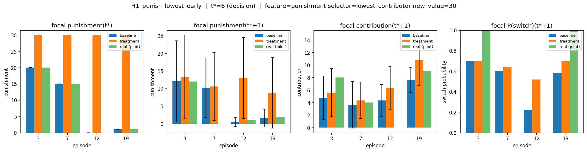

# Counter-factual Response Probe — 2g8a 50ep

Step-by-step explanation of how counterfactual probing was done:
For each (scenario, chosen episode, seed):

1. Slice the experiment data tensor [0..t*+1] for the chosen episode. Round 0..t* values stay as real experiment — no AH prediction at the intervention round.
2. Resolve the override for the focal's slot at round t*:
    - new_value: v → v (absolute).
    - factor: f → round(experiment[focal, t*] × f) (relative to experiment). Clamp to the model's encoder level count.
3. Treatment writes the override into prev_<feature>[t*+1, focal] in the prefix tensor. Non-focals' prev_*[t*+1] stay at the data's natural shift values. Baseline runs without any override.
4. One AH-stack forward over [0..t*+1] with reset_rnn=True → focal's round-t*+1 contribution, valid, switch.
5. Punishment AH at round t*+1 with AH-predicted round-t*+1 contributions and the (intervened-or-natural) prev_*[t*+1] from step 3 → focal's round-t*+1 punishment.

**Example config:**
```yaml
base_config: configs/simulation/counterfactual/punish_individual_late.yml
chosen_episodes: [0, 3, 7, 11, 12, 15, 19, 23]
n_seeds: 20
output_dir: artifacts/counterfactual/factor_big

grids:
  - intervention_round: [4, 6, 16, 18]
    feature: [punishment, contribution]
    target: [individual]
    agent_selector: [lowest_contributor, highest_contributor, random]
    factor: [0.33, 0.5, 0.75, 1.35, 2.0, 3.0]
```

## Model Features

`prev_X[t] = X[t-1]` is the standard one-round shift built in `data.py::shift`,
with a feature-specific default at round 0 (taken from `get_default_values`).

| Feature | Definition |
|---|---|
| `prev_contribution` | The agent's own contribution at round t-1 (int 0-20). |
| `prev_punishment` | Punishment received from the manager at round t-1 (int 0-30). |
| `prev_common_good` | Per-capita pool from round t-1, shared by all members of the agent's group at t-1. Computed in `data.py::parse_agent_rounds` as `(1.6 × sum_c − sum_p) / n_valid` divided by the group's valid contributors. |
| `agent_group` | The agent's current group id (0/1 in 2g8a), refreshed at each switch decision. |
| `prev_contribution_valid` | Boolean — `True` iff the agent actually had input at t-1 (`player_no_input == 0`). Lets the model discount imputed-zero rows. |
| `prev_punishment_valid` | Same as above for the manager (`manager_no_input == 0`). |
| `punishment_masked` | Autoregressive feature for the punishment AH only: holds the already-decided punishment for agents earlier in the within-round decoding order, and the default value for agents not yet decoded. Updated in `predict_autoreg` as each agent is sampled. |
| `autoreg_mask` | Boolean — `True` for agents whose punishment is still to be decoded in the current autoregressive pass; flipped to `False` once an agent has been sampled. |
| `is_first` | `True` only at round 0; lets the model condition on the no-history boundary. |

### Absolute Interventions

**Punish lowest contributer 30 punishment:**
- It shows clear upstick in the contribution in the round following.
- It motivates group switch also in the following round.
- Group switching is a lot less prevelant in later rounds.



**Forgive lowest contributer with 0 punishment:**
- Less motivation to switch teams.
- Mixed response in contribution

**Force 0 contribution to highest contributor:**
- Punishment increases.

**Force 30 contribution to lowest contributor:**
- Punishment decreases.


### Factor Interventions
- across 8 episodes
- early/late rounds
- Highest contributor/lowest contributor/random

**Contribution scaling**
- Self-dependence is definitely there.
- Punishment decreases with contribution scaling.
- Late round switch probability is very low.


**Punishment scaling**
- When high contributing model is punished a lot the response is almost no effect both in contribution and switching.
- Punishment is more motivating for low contributor for their next contribution.
- Punishment is more motivating low contributor to leave the group.
- Punishment decreases with contribution scaling.

### Group Interventions
- early/late
- Just before switch/not

**Higher contributing group gets punished 30:**
- Contribution increases consistently.
- Switch probability increases consistently.


**Lower contributing group gets punished 0:**
- Contribution does not change.
- Less switch probability. Late round less effect.
- Late round contribution slightly decreases.

**Lower contributing group gets punished 30:**
- Contribution increases consistently.
- Switch probability increases.

## Results
1. It is not as bad as shuffle shows.
2. Prev version of the feature definitely dominates effect.
3. If prev contribution is high then punishments have little to no effect. 