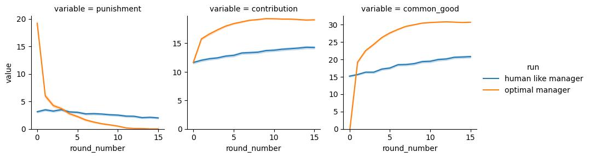
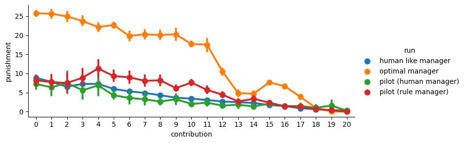

# Method

We follow in our our approach
(https://www.nature.com/articles/s41562-022-01383-x) adapeted to the case of
an governing agent imposing personalised punishments. The training process consist of the
following steps and components:

1. We collected in pilot studies human behavior on the task.
2. We trained a behavioral clone of human behavior on the task. We thereby
   trained seperate models for, a) contributions of participants, b) valid
   responses of participants, and c) punishment of a human governour.
3. We trained a optimal governour by training an RL based agorithm to govern
   behavioral clones of human contributor.

## Data Collection

to be filled

## Behavioral Cloning of Contributors

We train behavioral clones that are predicting behavior of human participants
based on historic contributions and punishments of all participants in a group.
We formulate the problem as classification problem, where the model is
predicting the probability of a participant to contribute a certain amount. We
model the influence of the other group members on the contribution of a single
participant by a graph neural network operating on a fully connected network. We
use a recurrent unit to allow for
temporal relationships. We found that both, social influence and temporal
relationships are important for the predictive performance of the model. Details
on the model architecture and its evaluation can be found in the supplementary material.

## Behavioral Cloning of Governour

We also train a behavioral clone predicting the punishment of a human
governour. While the different contributions in a single round are decided upon
independently by the different participants, the punishment is
determined by a single governour. Therefore the punishments within a single
round cannot be considered as independent. For this reason, we model the
punshiments autogressively. Besides the
autoregressive nature, the model architecture is identical to the one predicting
contributions. We found a strong improvement in predictive performance when
including the autoregressive component. Details on the model architecture and
its evaluation can be found in the supplementary material.

## Training an optimal governour

We train through reinforcment learning an governour to optimal punish the
behavioral clones of human contributors to maximize the common good. We use a deep Q-learning to
train the optimal governour maximising the cummulative common good accross all
rounds without discounting. The
architecture of the model is identical to the one predicting contributions, with
the acceptation that we omit the softmax operation and an additional bias term
to account for the cummulative nature of the rewards. Details on
the model architecture and its evaluation can be found in the supplementary
material.

# Supplementary Material

## Model architecture

Our model is structured into three distinct parts, following the graph network
(https://arxiv.org/abs/1806.01261) formalism. We use the same general
architecture for all three models, however we adapt the input features and the
output layer to the specific task. We represent the group as a fully connected
graph composed of four nodes, with each node corresponding to a group member.
Accounting for the direction of influence, we obtain 12 directed edges between
the nodes. Our architecture design ensures permutation symmetry in the
relationships between individuals and incorporates Gated Recurrent Units (GRUs)
to facilitate learning temporal relationships.

As the first module within the graph neural network, an edge model computes a
representation of the relationship between two nodes. To achieve this, we first
construct an edge feature vector by concatenating the features of the source and
target node of the particular edge. The edge model, a single-layer perceptron, is then applied to each of the 12
directed edges.

Second, a node model is applied to each of the four nodes. The output of the
edge model is averaged across all incoming edges of the target node.
Subsequently, the resulting vector is concatenated
with the features of the target node to form the input of the node model. The
node model consists of a single-layer perceptron, followed by a GRU and a final
linear layer. By positioning the GRUs after aggregating pairwise interactions,
we assume that temporal relationships are relevant at the global and individual
levels, but not at the pairwise relationship level.

Depending on the application, the output of the edge model serves as the
contribution, punishment, or Q-value of the node. For predictive models, a
softmax operation is applied to the output of the final layer. All linear layers
(except the final layer) and the GRU share the same number of output units,
referred to as 'hidden units' hereafter. We employ Rectified Linear Units (ReLU)
as the activation function for all layers.

## Behavioral Cloning of Contributors

We use supervised learning to train a model to predict the contribution of a
single participant in a given round. The model is trained on behavioral data
collected in pilot studies with a human and a rule based governour. In each round, we predict a multinominal distribution over the 21 possible contributions
for each of the 4 group members. We optimize the model on the cross-entropy
loss. Cases in which participants do not enter a contribution are masked and do
not enter the loss.

Three features enter the model: the contribution of the participant in the
previous round, the punishment of the participant in the previous round, and a
binary variable indicating whether the participant entered a valid contribution
in the previous round. The fist two features are scaled to the range 0 to 1. The latter feature is necessary to account for the fact
that some participants fail to enter a contribution in some rounds. We
investigate the individual importance of the input features on the model
performance, by individually shuffling them and calculating the resulting
increase in loss. We find the model to be dominantly rely on previous
contribution. However, all three features do contribute. We
investigated including additional features, such as the average contributions of the
other participants, but we found that models including the edge model
did not benefit from these additional features. We therefore decided to use the
minimal set of features described above.

We used the neural network architecture described above to train the model.
We train the models using an Adam Optimizer with a learning rate of 0.003.
Gradients are clamped at absolute 1. We train batches of the full episodes of 10
groups. We train for 10000 epochs in total. We used 5 hidden units in all layers.

We investigate the effect of different components of the architecture on the
models cross validated predictive performance.

We found a significant reduction in the cross-validated loss when including the
social influence through the edge model and when including temporal dependencies
through the recurrent unit. The model with both components performed best and we
therefore used it for all further analyses and to train the optimal governour.

We investigated formulating the problem as a regression instead of a
classification. However, shrinkage resulted in missing out on the extremes (i.e.
contributions of 0 or 20). Also predicting contributions as point values does
not allow to capture mixed strategies, i.e. cases in which participants in a
given situation randomly decide between different contributions.

We investigated the influences of the number of hidden units, the batch size
and the learning rate on the model performance. We found that the model to be
robust to these hyperparameters within a reasonable range. With 5 hidden units we choose the
smallest number of hidden units without compromising the model performance.
Thereby we intent to reduce the risk of overfitting, specifically given that
this model is used to train the governour.

## Behavioral Cloning of Gouverneur

Like the model for the contributors, we use supervised learning to train a model
to predict the punishment of a single participant in a given round by a human
governour. The model is trained on behavioral data collected a pilot study with
a human governour. The human governour is punishing all participants on the same
screen in random order. To capture this and the related correlation between the
punishments, we train the model to predict the punishment of all participants in
the same round autorergressively. Toward that goal, during training, we
randomly select a subset of the participants to be predicted and add the
punishment of the other participants as input features. For inference, we
likewise iteratively predict the punishment of each participant and previously
predicted punishments as features.

We use the same architecture as for the model of the contributors. In total 6
feature enter the model: the contribution of the participant in the current
round, the punishment of the participant in the previous round,
a binary variables indicating whether the participant entered a valid
contribution and punishment, the punishment of (other) participants in the
current round, and a binary variable indicating the availability of the
the latter. The fist two features are scaled to the range 0 to 1.

We investigate the effect of different components of the architecture on the
models cross validated predictive performance.

The edge model turns out to be the most important component of the model. This
is related to the autorregressive formulation of the problem. The edge model
allows for the model to utilize the information about the punishment of the
other participants in the current round. The recurrent unit does not improve the
model significantly. We therefore decided to use the model without the recurrent
unit for all further analyses.

## Optimal Gouverneur

We use reinformcement learning to train a policy to punish participants with the
goal to maximize the cumulative common good of the group. We train the policy using deep Q
learning.

As described above, we use the behavioral cloning models to predict the
contribution of the participants in the current round. We use a small independent
model to additionally predict whether a participant enters a valid contribution.
We combine these models to predict the behavior of human participants in the group
conditioned on the punishment of the governour.

We compute a reward that is reflecting the common good of the group. To ease the
learning process, we reward the governour after a punishment with the
contributions in the next round (multiplied by 1.6) discounted by the governours
punishment in the current round.

$$
R_i = C_{i+1} * 1.6 - P_{i}, \quad i < n-1 \\
R_n = -P_n
$$

We omit the contribution of the first round, as it cannot be influenced by the
governour. We use a discount factor of 1. The policy hence maximizes the
cumulative common good of the group over the course of the game (with the
exception of the first contribution).

$$
R_{tot} = 1.6 * \sum_{i=2}^{n} C_i - \sum_{i=1}^{n} P_i
$$

The general architecture of the optimal governour is the same as for the
behavioral clones. The output of the model is the q-value of the different
potential punishments. Hence we use a linear output layer without activation
function. The Q-values are decaying over the course of the game. We found that
adding the round number as a onehot encoded input to the model stabilizes the
training. This solution is somewhat unsatisfing, as it inflates the number of
weights in the first layer, potential spurious correlations and might lead to overfitting. We therefore removed
the round number from the features of the main model, but added a second
additive bias to the final output of the model that is derived soley from the
round number. We found this solution to be stable and to perform well.

We define an episode as a batch of 1000 groups of 4 behavioral clones for 16
steps which we run vectorized in parallel. We run 20000 episodes in total. We
update the governour policy after each episode. We use a replay memory of 100
episodes. We use a target network to stabilize the training. We update the
target network every 1000 steps. We use an RMSprop optimizer with a learning
rate of 3.e-4. We use a discount factor of 1. We use an epsilon greedy policy
with an epsilon of 0.1. We use a hidden size of 100 for all hidden layers.

These parameters where the result of a hyperparameter optimization. We found the
no significant influence of the memory size. We found that more frequent target
network updates leading to instablilities in the training, while less frequent
updates lead to slower convergence. We found strong influence of the number of
hidden units on the performance up to 100 hidden units. We found an epsilon of
0.1 to outperform larger values.

We investigate the effect of different components of the architecture on the
maximum common good achieved by the governour.

The recurrent unit turns out to be the most important addition to the model.
As the full model with recurrent unit and edge model performed significantly better than the model without the
egde-model, we decided to use the full model for all further analyses and the
final experiment.

## Simulation and Evaluation

### Simulation

We simulate the behavior of the behavioral clones and the optimal governour. To
allow for direct comparision with the pilot study with a human governour, we
created a version of behavioral contribution clones that was trained only on
data from this specific pilot study.

We found that aggregated behavior of the cloned governour well matches the
behavior of the human governour in the pilot study. We found a small deviation
in the average contribution level of the cloned contributors.

We then simulated the behavior of the cloned governour and the optimal governour
when interacting with cloned contributors trained on the data from both pilots.

We find that the optimal punishes more than the cloned governour in the first
rounds. This then leads to higher contributions in the later rounds. The optimal
therefore outperforms the cloned governour in terms of the cumulative common good of the
group.

Based on these simulations, we then investigated the empirical policies of the
different governours.

We find that the cloned governour punished similar to the human governour for
the respective contribution levels. The optimal governour on the other hand
punishes more than the other governours in particular for low contribution. We
also observe that the punishments are not monotonically increasing with the
contribution level. For instance the punishments for a contribution of 13 are on
average lower than for a contribution of 15.
