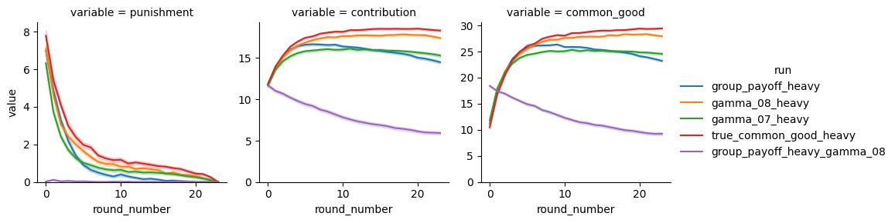
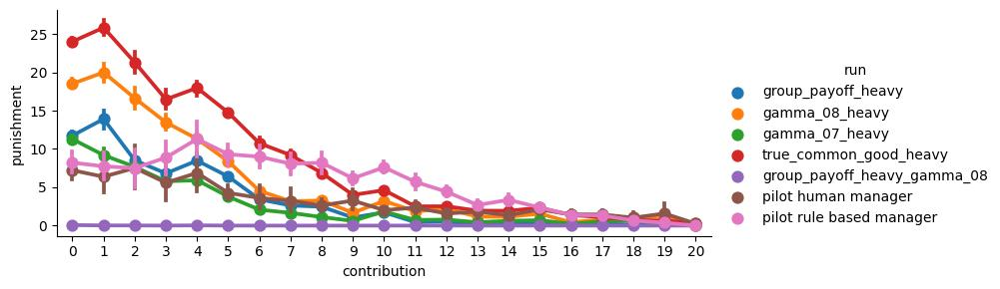
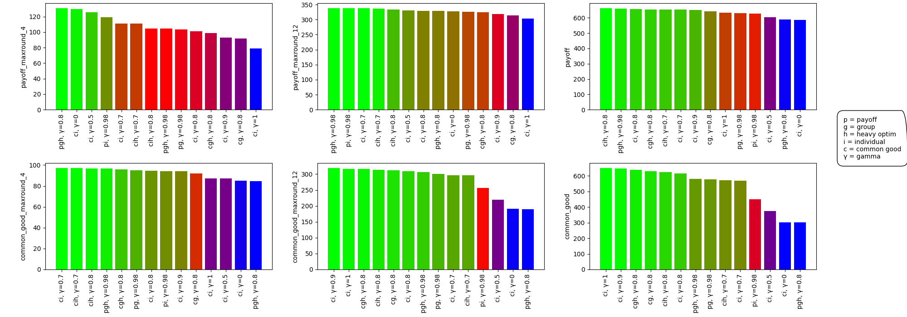
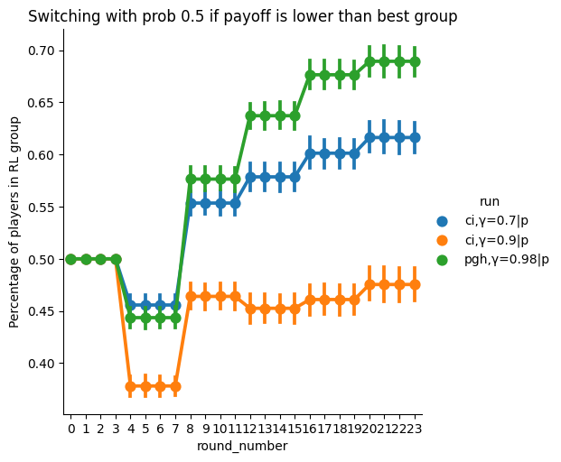

# How to train and evaluate the manager for experiment 1 (RL manager and human participants, no group selection)
All training and evaluation happened on TARDIS (no other cluster tried)
We are using the main branch of [this repository](https://github.com/center-for-humans-and-machines/algorithmic-institutions/tree/main)

## Behavioral clones
This is pretty much unmodified from the code when I joined the project. And I did not really explore in that direction.
* `djx run/behavioral_cloning/21_contribution_model_v4.yml`
* `djx run/behavioral_cloning/22_contribution_valid_model_v4.yml`

There are artifacts for the expected resulting models at `artifacts/behavioral_cloning/21_contribution_model_v4/model` and `artifacts/behavioral_cloning/22_contribution_model_v4/model`.

Note: If you fail to load any model artifact, the reason is very likely that the `torch_geometric` version that you are using is different from the one that created the artifact.

## RL model
Here I tried out a lot of different reward functions. The config I ended up with is at [run/manager/17_exp2_group_payoff_heavy_optimize.yml](../run/manager/17_exp2_group_payoff_heavy_optimize.yml). To train it run
* `djx run/manager/17_exp2_group_payoff_heavy_optimize.yml`

The resulting model is also stored as an artifact in this repo at [artifacts/manager/17_exp2_group_payoff_heavy_optimize/model/_manager.pt](../artifacts/manager/17_exp2_group_payoff_heavy_optimize/model/_manager.pt).

The other yml files in `run/manager` are mostly for different reward functions.

## Performance Evaluation
The evaluation .yml files are in `notebooks/test_manager/simulate_mixed`. They specify the managers that should be compared in this run. You probably want to create your own new yml file where you specify just the managers that you trained.

Simulation does not use GPU and is not started with djx. I think I might have actually been running them on the login node or on my laptop. Running simulations does tend to take a while as well.

They are for example started with `python run.py run notebooks/test_manager/simulate_mixed/12_heavies.yml`.

As a result, you get a folder at `notebooks/test_manager/simulate_mixed/12_heavies`. That one includes some plots like the following:




But you also get a `data.csv` file in the folder that contains all simulation data.

These `data.csv` can further be used to create a plot like this



This plot is created using [key_eval_measures.py](../notebooks/test_manager/key_eval_measures.py). You will need to adapt the line
```python
df = load_data(["05_all", "10_few", "11_one", "09_some", "12_heavies"])
```
to include the simulation runs that you actually have.

## Group Selection Evaluation
At `notebooks/test_manager/simulate_group_selection.ipynb` you find code to simulate group selection behavior with the RL managers and the humanlike manager. You may want to adapt the loaded managers to the ones that you train. This is still very crude given that our humanlike manager model is pretty bad. So I'd guess we need to work on new evaluations that maybe make use of the experiment 1 data or the experiment 2 pilot data.

But with this, you can create plots like this




## Python Environment
I did not fully follow the version specifications that you have been freezing in the requirements files from algorithmic-institutions and djx (Ran into some issues and hacked myself to a solution with different versions). I think that is something you will have to figure out yourself. But I'll leave you a `pip freeze` of the environment I used here.

<details>
<summary>Python environment</summary>

```
-e git+ssh://git@github.com/center-for-humans-and-machines/algorithmic-institutions.git@d304743b6d82e45c49f93388dd45686728f9328c#egg=aimanager
aiohttp==3.9.3
aiosignal==1.3.1
annotated-types==0.6.0
anyio==4.4.0
argon2-cffi==23.1.0
argon2-cffi-bindings==21.2.0
arrow==1.3.0
asttokens==2.4.1
async-lru==2.0.4
async-timeout==4.0.3
attrs==23.2.0
autopep8==2.0.4
babel==2.16.0
beautifulsoup4==4.12.3
black==24.2.0
bleach==6.1.0
certifi==2024.2.2
cffi==1.17.1
charset-normalizer==3.3.2
click==8.1.7
cmake==3.25.0
comm==0.2.1
contourpy==1.2.0
cycler==0.12.1
debugpy==1.8.1
decorator==5.1.1
defusedxml==0.7.1
-e git+ssh://git@github.com/dkollective/djx.git@11cd5334bf7518f1e6f1a096eb43655621885287#egg=djx&subdirectory=../../djx
docopt==0.6.2
entrypoints==0.4
exceptiongroup==1.2.0
executing==2.0.1
fastjsonschema==2.19.1
filelock==3.9.0
flake8==7.0.0
fonttools==4.49.0
fqdn==1.5.1
frozenlist==1.4.1
fsspec==2024.2.0
h11==0.14.0
httpcore==1.0.5
httpx==0.27.2
idna==3.6
importlib-metadata==7.0.1
importlib_resources==6.1.2
iniconfig==2.0.0
ipdb==0.13.13
ipykernel==6.29.3
ipython==8.18.1
ipywidgets==8.1.5
isoduration==20.11.0
jedi==0.19.1
Jinja2==3.1.3
joblib==1.3.2
json5==0.9.25
jsonpointer==3.0.0
jsonschema==4.21.1
jsonschema-specifications==2023.12.1
jupyter==1.1.1
jupyter-console==6.6.3
jupyter-events==0.10.0
jupyter-lsp==2.2.5
jupyter_client==8.6.0
jupyter_core==5.7.1
jupyter_server==2.14.2
jupyter_server_terminals==0.5.3
jupyterlab==4.2.5
jupyterlab_pygments==0.3.0
jupyterlab_server==2.27.3
jupyterlab_widgets==3.0.13
kiwisolver==1.4.5
lit==15.0.7
lxml==5.1.0
MarkupSafe==2.1.5
matplotlib==3.8.3
matplotlib-inline==0.1.6
mccabe==0.7.0
mistune==3.0.2
mpmath==1.3.0
multidict==6.0.5
multimethod==1.11.2
mypy-extensions==1.0.0
nbclient==0.9.0
nbconvert==7.16.4
nbformat==5.9.2
nest-asyncio==1.6.0
networkx==3.2.1
notebook==7.2.2
notebook_shim==0.2.4
numpy==1.26.4
overrides==7.7.0
packaging==23.2
pandas==1.5.3
pandera==0.18.0
pandocfilters==1.5.1
papermill==2.5.0
parso==0.8.3
pathspec==0.12.1
patsy==0.5.6
pexpect==4.9.0
pillow==10.2.0
platformdirs==4.2.0
pluggy==1.4.0
prometheus_client==0.20.0
prompt-toolkit==3.0.43
psutil==5.9.8
ptyprocess==0.7.0
pure-eval==0.2.2
pyarrow==6.0.0
pycodestyle==2.11.1
pycparser==2.22
pydantic==2.6.3
pydantic_core==2.16.3
pyflakes==3.2.0
pyg-lib==0.4.0+pt20cu118
Pygments==2.17.2
pyparsing==3.1.2
pytest==8.0.2
python-dateutil==2.9.0.post0
python-json-logger==2.0.7
pytz==2024.1
PyYAML==6.0.1
pyzmq==25.1.2
referencing==0.33.0
requests==2.31.0
rfc3339-validator==0.1.4
rfc3986-validator==0.1.1
rpds-py==0.18.0
scikit-learn==1.4.1.post1
scipy==1.12.0
seaborn==0.11.2
Send2Trash==1.8.3
six==1.16.0
sniffio==1.3.1
soupsieve==2.6
stack-data==0.6.3
statannotations==0.6.0
statsmodels==0.14.1
sympy==1.12
tenacity==8.2.3
terminado==0.18.1
threadpoolctl==3.3.0
tinycss2==1.3.0
tomli==2.0.1
toolz==0.12.1
torch==2.0.0+cu118
torch-cluster==1.6.3+pt20cu118
torch-scatter==2.1.2+pt20cu118
torch-sparse==0.6.18+pt20cu118
torch-spline-conv==1.2.2+pt20cu118
torch_geometric==2.5.0
tornado==6.4
tqdm==4.66.2
traitlets==5.14.1
triton==2.0.0
typeguard==4.1.5
types-python-dateutil==2.9.0.20240906
typing-inspect==0.9.0
typing_extensions==4.10.0
uri-template==1.3.0
urllib3==2.2.1
wcwidth==0.2.13
webcolors==24.8.0
webencodings==0.5.1
websocket-client==1.8.0
widgetsnbextension==4.0.13
wrapt==1.16.0
yarl==1.9.4
zipp==3.17.0
```

</details>