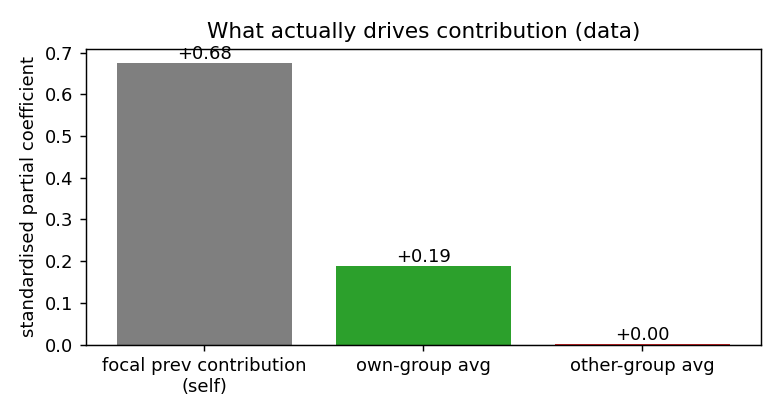
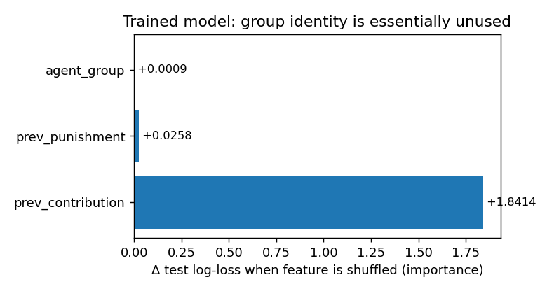

# Expressiveness of the contribution AH — group-average & own-vs-other disentanglement

**Model under analysis:**
`configs/training/artificial_humans/contribution/group_switching_contribution_50ep.yml`
— a `graph` artificial-human (`GraphNetwork`, `src/aimanager/generic/graph.py`)
predicting the next contribution (21 levels) of each player in the 2-group /
8-agent / 50-episode group-switching data.

**Questions.**
1. Can the model learn *how the average contribution of a participant's group
   influences their contribution?*
2. Can it *disentangle* the influence of people in the participant's **own**
   group from people in the **other** group?

This report separates three distinct claims that the word "can" hides:

- **Representational capacity** — can the architecture *encode* the function?
- **Identifiability** — does the *data* contain a separable own-vs-other signal?
- **Learnability** — does the *trained model* actually do it?

The short answer: **(1) yes, easily; (2) yes in principle, but the trained
model does not — and the data explains why it had little reason to.**

---

## TL;DR

| Question | Capacity | In the data | Trained model |
|---|---|---|---|
| Group-average → contribution | **Yes** — mean aggregation *is* an average | own-group avg has a real partial effect (β≈0.19) | partly, as a blended pool (group-undifferentiated) |
| Own vs other disentanglement | **Yes in principle** (group-typed edge channels), with caveats | separable (corr 0.20); but other-group partial effect ≈ **0.00** | **No** — `agent_group` importance ≈ 0 (Δlog-loss **+0.0009**) |

The model is *capable* of group-conditioned social influence, but in its trained
state it essentially ignores group identity. That is not (only) an optimisation
failure: in this data the other group's average contribution has **no**
independent effect on a player's contribution once self and own-group are
controlled, so "disentangling" reduces to "attend to the own group, ignore the
other" — and the payoff for learning even that is small relative to the
dominant self-term.

---

## 1. What the model actually sees

This particular config is lean. The only node features are:

| Feature | Encoding | Size | Role |
|---|---|---|---|
| `prev_contribution` | numeric (scaled 0–1) | 1 | own/neighbour contribution at t−1 |
| `prev_punishment` | numeric (scaled 0–1) | 1 | own/neighbour punishment at t−1 |
| `agent_group` | **one-hot**, 2 levels | 2 | current-round group id (0/1) |

Two facts are decisive for the questions:

- **There is no global / per-group summary feature.** `add_global_model: False`,
  `u_encoding` is empty, and — unlike what `reports/counterfactuals_2g8a_50ep.md`
  describes for other AHs — **`prev_common_good` is *not* in `x_encoding`**.
  The per-capita pool (≈ a sufficient statistic for the group's average
  contribution) is therefore *not handed to the model*. **The only route by
  which "the average contribution of my group" can influence a prediction is the
  graph message-passing.** If the graph cannot carry it, nothing can.

- **The graph is fully connected across *both* groups, and group membership is
  only a node label.** `train.py::create_fully_connected` ignores its
  `n_agent_groups` argument and wires all 8 players to each other (8×7 = 56
  directed edges per episode). Edges carry no features (`EmptyEncoder`). So the
  model is *not* told which neighbours share the focal player's group — it must
  infer "same group" by comparing the source and destination `agent_group`
  one-hots inside the edge network.

---

## 2. The architecture, concretely

Per round, for the focal node *d* with neighbours *s* (forward pass in
`GraphNetwork.forward`; dims for this config in brackets):

```
x_s, x_d = (prev_contribution, prev_punishment, agent_group_onehot)   [4 dims each]

edge:  m_{s→d} = tanh( W_e · [x_s , x_d] + b_e )                       [W_e: 8→20]
node:  h_d     = tanh( W_n · [x_d , mean_s m_{s→d}] + b_n )            [24→20]   (op1)
rnn:   h_d(t)  = GRU(h_d(t), h_d(t-1))                                 [20→20]
out:   logits  = W_o · h_d                                            [20→21]    (op2, linear)
```

Key structural points:

- **`mean_s m_{s→d}` is a plain `scatter_mean` over all 7 neighbours** — one
  blended pool, normalised by the (constant) degree 7. There is **no per-group
  aggregation**.
- The focal's **own** features `x_d` enter the node update directly (the
  `[x_d, …]` concatenation), bypassing the graph — this is the self-dependence
  channel.
- The edge network is a **single linear layer + tanh**. All group-conditioning
  must be squeezed through that one nonlinearity, because the source/destination
  group one-hots are its only handle on "who is whose group-mate".

---

## 3. Q1 — Can it learn the group-average → contribution effect?

**Yes, and it is the model's natural inductive bias.** `scatter_mean` *is* an
average. In the small-signal regime tanh is ≈ linear, so
`mean_s tanh(α·c_s + …) ≈ affine(mean_s c_s)`: the node update is, to first
order, an affine function of the **mean neighbour contribution**. Conditional
cooperation ("I move toward what my group did") is therefore directly
representable, and cheaply.

**Caveat:** the average the model computes *for free* is over **all 7
neighbours = both groups blended**, not the own-group average. Turning that into
an *own-group* average is exactly question 2.

---

## 4. Q2 — Can it disentangle own- from other-group? (capacity)

**Yes, in principle.** Although membership is encoded absolutely (a per-node
one-hot) rather than relationally (a "same-group" edge flag), the edge network
receives **both** endpoints' group one-hots, and each of the four
(source-group, dest-group) combinations is an **AND of two one-hot literals**,
which is *linearly separable*. A single `linear+tanh` edge unit can therefore
gate on it.

Concretely, to build a "contribution, but only from own-group-0 mates" channel,
set the group weights so the pre-activation offset is large-positive only when
both endpoints are in group 0 (e.g. weight `K` on `1[g_s=0]` and `1[g_d=0]`,
bias `−1.5K`): the offset is `+0.5K` iff both are in group 0 and `≤ −0.5K`
otherwise. Passed through tanh, that offset acts as a **soft multiplicative gate
on the contribution slope** — the unit stays responsive to `c_s` when both are
in group 0 and saturates flat otherwise. Repeat for group 1 and sum the two in
the linear readout → an **own-group (same-group) contribution channel**; the
`(0,1)` and `(1,0)` units give the **cross-group** channels. With 20 edge units
plus a second nonlinearity (the op1 node tanh), the network has ample room to
form approximately **group-typed message channels**.

So the disentanglement is **within representational reach**. But three caveats
make it approximate and make it something the optimiser must be *pushed* to
learn:

- **(a) Mean-pool re-imposes a size weighting (the "division" problem).**
  `scatter_mean` divides by degree 7 (constant), not by group size. A
  same-group-gated channel mean-pools to `((n_own−1)/7)·mean_own φ(c)` — a
  **size-weighted** quantity, not the pure own-group mean. Recovering the pure
  average needs a division by `(n_own−1)/7`, which a tanh-MLP can only
  approximate. This would be harmless if groups were a fixed 4/4 split — but
  here group sizes range **1–8 (mean 4.26, std 2.01)** and **75% of
  focal-rounds have an own-group size ≠ 4** (group switching), so the
  size-weighting is a real, *varying* confound.

- **(b) Soft, parameter-hungry gating.** The gate is tanh saturation, not a hard
  switch; the contribution *slope* within any single unit is shared across
  group-combinations and only re-shaped by the offset. Clean separation costs
  several units and is never exact.

- **(c) Absolute, not relational, encoding.** Because group is a per-node
  one-hot, the model must *learn* the equality `g_s == g_d`. An explicit
  `same_group` edge feature (or relational/typed aggregation) would make the
  distinction free instead of something to be discovered.

---

## 5. Does it actually disentangle? Identifiability + learnability

Capacity is necessary, not sufficient. Two checks on the *data* and the *trained
model* (reproducible via
`scripts/data_analysis/expressiveness_group_disentanglement.py`).

### 5a. Is the signal even there to be separated?

Per focal-round, comparing the own-group co-members' mean previous contribution
against the other-group mean previous contribution (own group = focal's
current-round group), N = 15,624 focal-rounds:

- **Separable:** `corr(own_avg, other_avg) = 0.20` — the two averages move fairly
  independently (group switching actively decorrelates them). Identifiability is
  *not* the bottleneck.
- **But the other-group effect is ~zero.** Standardised OLS of contribution on
  self + own + other:

  | predictor | standardised β |
  |---|---|
  | focal prev contribution (self) | **+0.68** |
  | own-group avg | **+0.19** |
  | other-group avg | **+0.00** |

  Self dominates; there is a **real but modest own-group** conditional-cooperation
  effect; and **no independent other-group effect on contribution** once self and
  own-group are held fixed. (The other group plausibly drives the *switching*
  decision, not the *contribution* level — consistent with
  `reports/counterfactuals_2g8a_50ep.md`.)



**Implication:** the *ideal* disentanglement here is asymmetric and simple —
weight the own group, **ignore** the other group. There is essentially nothing
in the other-group channel worth recovering.

### 5b. Does the trained model use group identity at all?

From the training metrics parquet (CV-averaged, final-epoch test log-loss;
baseline = 1.9897):

| perturbation | Δ test log-loss |
|---|---|
| shuffle `prev_contribution` | **+1.84** |
| shuffle `prev_punishment` | +0.03 |
| shuffle **`agent_group`** | **+0.0009** |
| keep **only** `prev_contribution`, shuffle rest | +0.03 |
| keep only `agent_group`, shuffle rest | +1.93 |



- **`agent_group` is essentially unused: shuffling it costs 0.0009 nats** — and
  it stays ≈ 0 across *all* of training (epochs 0→550), so the model never even
  begins to lean on group membership.
- `prev_contribution` alone recovers almost the entire model (keep-only Δ = +0.03);
  `agent_group` alone recovers almost nothing (keep-only Δ = +1.93).

Since group identity is the **only** signal that could let the model tell
own-group from other-group neighbours, **near-zero `agent_group` importance means
the trained model does not disentangle them** — it treats all seven neighbours
as one undifferentiated pool (to the limited extent it uses neighbours at all).

> **Caveat on the social-influence magnitude.** The `prev_contribution` shuffle
> permutes *whole episodes*, so it perturbs the focal's **own** lag and the
> neighbours' lags together; the +1.84 is dominated by self-dependence and does
> **not** cleanly isolate graph/social influence. The clean test is the
> counterfactual probe in §6.

### 5c. Why the optimiser settled here

This is coherent, not a bug. The blended 7-neighbour mean already correlates
with the own-group mean (own members are 3–7 of the 7), so an
*un*-gated pool captures most of the available — and modest (β≈0.19) —
own-group effect. The marginal log-loss to be won by learning clean group-gates
is tiny next to the self-term (β≈0.68), and with early stopping (575-epoch cap),
light weight-decay (1e-5), and only 20 hidden units, the path of least
resistance is a self-dominated solution that does not bother with group
structure.

---

## 6. Verdict and recommendations

**Answers.**
1. *Group-average → contribution:* **representable and natural** (mean
   aggregation), and there is a genuine own-group effect to capture — but in this
   config it can only arrive through the graph (no `common_good` feature), and
   the trained model captures it only as an undifferentiated neighbour pool.
2. *Own vs other disentanglement:* **the architecture can represent it**
   (group-typed edge channels), the **data permits it** (own/other separable),
   but the **trained model does not perform it** (`agent_group` ≈ unused) — and
   the upside is small because the other-group contribution effect is ≈ 0.

**Definitive confirmatory test (needs the cluster — PyG).** Load the trained
`.pt` and run a group-swap counterfactual with the existing machinery
(`src/aimanager/simulation/counterfactual.py`, `intervention_probe.py`): hold the
focal player and all else fixed, then (i) shift the **own-group** neighbours'
`prev_contribution` by Δ and (ii) shift the **other-group** neighbours' by the
same Δ, and compare the change in the focal's predicted contribution.
Capacity-to-disentangle predicts a *larger* own-group response; the
feature-importance result (§5b) predicts the two responses will be **nearly
equal** (group label carries ≈ no weight). This is the empirical confirmation of
the §5b inference.

**If you want to close this gap**, two complementary changes help: an explicit
`same_group` *edge* feature, and the relevant group summary as an **own-group
node feature** (the focal's own-group aggregate at t−1) rather than a global one —
a clean, group-specific signal that side-steps the graph's division problem.
§7 quantifies *which* summaries are worth adding; §8 covers *how* to wire
`same_group` and whether `agent_group` can then be dropped.

---

## 7. Which group features are worth adding?

Three candidates — `group_avg_contribution`, `group_common_good`,
`group_avg_punishment` — tested directly on the data (companion script in the
Appendix). Each candidate is
the focal's **own-group** aggregate at t−1; the target is the focal's
contribution at t. Standardised OLS, N = 15,624 (a *linear* lower bound on what a
network could extract). Three views, because each isolates a different thing:

| Own-group feature | **alone** R² (univariate) | **+self** ΔR² (added individually to self) | **cumulative** ΔR² (added in sequence) | **unique** (drop from full) |
|---|---|---|---|---|
| self (`prev_contribution`) | 0.589 | — | — | — |
| **avg contribution** | 0.266 | **+0.027** | **+0.027** | −0.014 |
| **common good** | **0.287** | **+0.011** | **+0.000** | −0.000 |
| **avg punishment** | 0.002 | +0.000 | +0.001 | −0.001 |

- *Alone* = the feature as the only predictor (univariate).
- *+self* = the feature added to self alone — its value if it were the only group
  feature you added.
- *Cumulative* = added on top of all rows above it (self → +avg_c → +cg → +avg_p).
- *Unique* = R² lost if it is dropped from the full self+all-three model.

The instructive contrast is **common good**: it is the *strongest* group feature
**alone** (0.287 > avg contribution's 0.266), yet it adds the *least* once self is
present (+0.011 vs +0.027) and **nothing** cumulatively (+0.000). Reason: it is
collinear with both self (r = 0.59) and avg contribution (r = 0.74), so its raw
predictive power overlaps signal the model already has. avg contribution is the
*better complement* to self even though it is weaker in isolation.

| collinearity | self_c | avg_c | common_good | avg_p |
|---|---|---|---|---|
| common_good | 0.59 | **0.74** | 1.00 | −0.29 |

**Verdict.**

- **Own-group average contribution — add it.** It is the one feature that pays:
  a real, if modest, lift (+0.027 R²; cf. the own-group β ≈ 0.19 in §5a) and,
  added as a per-node own-group feature, it directly closes the disentanglement
  gap from §5b without the model having to learn group-gating in the graph. The
  linear +0.027 is likely a *lower bound* on its practical value here, since the
  trained model currently extracts the own-group signal only through the graph
  path it fails to exploit.
- **Group common good — skip (for the contribution AH).** It is ≈ collinear with
  average contribution (r = 0.74) and adds **0.000** R² on top of it; for
  predicting *contribution* it is redundant. (It is the natural target for the RL
  manager and a plausible driver of *welfare/switching* behaviour — so it may
  earn its place in the **switch** predictor or the manager reward, just not
  here.) If you add only one "what did my group do" summary, prefer average
  contribution: it is cleaner (always positive; common good is signed, −101…241,
  and folds punishment in).
- **Group average punishment — low priority.** Negligible unique signal (+0.001
  R²) for contribution; the per-node `prev_punishment` already feeds the graph.

Given the small (50→100 episode) dataset already needed early stopping to avoid
overfit drift (3/5 folds), parsimony matters: **add the one feature that pays
(own-group average contribution), skip the two that don't.** Other-group versions
are not worth adding for the contribution target (§5a: other-group effect ≈ 0).

---

## 8. Implementation — a `same_group` edge feature (and dropping `agent_group`)

The cleanest architectural fix for the disentanglement gap (§4, caveat c) is a
`same_group` *edge* feature: a per-edge bit that tells the edge MLP whether the
two endpoints share a group. **This is easy — the edge-feature path is already
plumbed end-to-end; `EmptyEncoder` is a placeholder for exactly this.**

### Already in place (no changes)

- **`EdgeModel.forward` already concatenates `edge_attr`** into the message:
  `th.cat([src, dest, edge_attr, u[batch]], …)` (`graph.py:22`).
- **`GraphNetwork.forward` already reads `edge_attr`** from the data dict if
  present, else falls back to an empty `(…,0)` tensor (`graph.py:214-221`). A
  non-empty edge feature flows through untouched.
- **`EdgeModel.__init__` sizes its linear from `edge_features`** =
  `self.edge_encoder.size` (`graph.py:12, 116, 127`). Report size 1 and the
  layer is sized automatically.

### What you add (~20–40 lines, all in `graph.py`)

1. **Swap the hard-coded encoder** at `graph.py:111`
   (`self.edge_encoder = EmptyEncoder(...)`) for a same-group encoder with
   `.size = 1`, gated on a config flag.
2. **Compute the feature in `encode()`** (`graph.py:234`) and insert
   `"edge_attr"`. `agent_group` is already loaded with the same layout as `x`, so
   indexing with the existing `edge_index` guarantees consistent ordering and
   batching:
   ```python
   ag = data["agent_group"].flatten(0, 1)             # (N, n_rounds)
   row, col = edge_index
   encoded["edge_attr"] = (ag[row] == ag[col]).float().unsqueeze(-1)  # (E, n_rounds, 1)
   ```
3. **Persist the flag** through `__init__` + the `save()` attr list
   (`graph.py:360`) so `encode()` rebuilds the feature at load. The trained
   `EdgeModel` weights live inside `op1`, saved/loaded wholesale, so the sized
   linear survives — only the flag is needed to re-enable construction.

Nothing else changes: not `EdgeModel`, not `forward`, not the training loop, not
the data pipeline, and configs need only the one flag.

### Care items

- **`encode()` is the single chokepoint** for training, `predict_independent`,
  and `predict_autoreg` — adding `edge_attr` there covers every path at once.
- **`agent_group` is time-varying** (refreshed at switches); the `(N, n_rounds)`
  indexing makes `same_group` per-round automatically, matching how the node
  feature is already used.
- **Don't mix states**: flag on ⇒ `size = 1` and `encode()` must *always* emit
  `edge_attr`; flag off ⇒ keep `EmptyEncoder` (`size = 0`) and the empty
  fallback. A size/shape mismatch is the only real failure mode.
- One small shape test + a Raven run (PyG is Linux-only).

**Effort: low** — ~1 hour plus a test run, low risk, because the wiring exists.
Larger scope (a general configurable `edge_encoding` mechanism) is more work and
needs its own abstraction, since relational features don't fit the per-node
`Encoder`.

### Can we then drop the `agent_group` node feature?

**Likely yes — but confirm with a CV ablation, and don't expect it to be carrying
the switching signal.** Three points:

- **Routing role is subsumed (and improved).** `agent_group`'s only useful job
  here was to let the edge MLP *infer* same-vs-different group by comparing the
  two endpoints' one-hots (the AND-gate burden of §4). A `same_group` edge
  feature hands that bit over directly, so for own/other routing it strictly
  *replaces* `agent_group` and does it better.
- **Absolute-label role is already neutralised by design.** The pair
  augmentation (each competition appears with `governorA→0` and `governorA→1`)
  deliberately symmetrises the two groups, so the absolute label 0/1 carries no
  consistent signal — which is exactly why shuffling `agent_group` costs ≈ 0
  (§5b). There is little absolute-identity information to lose.
- **It does *not* indicate switching.** `agent_group` is the *current-round*
  label, not a change indicator; a switch is a *change* between rounds. The model
  cannot read "this agent just switched" from the current label alone (the RNN
  could in principle track changes over time, but only weakly, and dropping the
  node feature removes even that). If switching-awareness is wanted in the
  contribution model, the right features are the ones the pipeline *already*
  produces — `does_switch` / `prev_agent_group` (`data.py` even notes "Pair with
  prev_agent_group in the model") — added explicitly, not `agent_group` as a
  proxy.

  Empirically, switching barely moves *contribution* anyway: switch rounds are
  5.9% of focal-rounds, switched players contribute 9.58 vs 9.34 for stayers, and
  adding `does_switch` to self+own-avg lifts R² by only **+0.0018** (β ≈ 0.04).
  So switching is a real but second-order driver of contribution (it matters far
  more for the *switch* predictor). Keep/add a switch feature only if that small
  lift is worth a parameter; it is not a reason to retain `agent_group`.

### Recommended experiment (hand-off)

Add the three features and measure each one's real gain with a 5-fold CV
log-loss ablation against the current model. Suggested arms, each trained with
the existing `group_switching_contribution_50ep.yml` recipe (575 epochs, 5
folds):

| Arm | Change vs baseline | What it isolates |
|---|---|---|
| **M0** baseline | current 3 features | reference |
| **M1** + `same_group` | edge feature (§8 above) | clean own/other routing in the graph |
| **M2** + `does_switch` | node feature (config-only; already in `data.py`) | switch-arrival effect on contribution |
| **M3** + own-group avg contribution | node feature (needs a preprocessing add) | explicit own-group social signal |
| **M4** + all three | combined | redundancy / best case |
| **M5** M4 − `agent_group` | drop the unused node label | confirm `agent_group` is droppable |

Gain of a feature = `log_loss(M0) − log_loss(Mi)`, CV-averaged. Implementation
notes per feature:

- **`same_group`** — code change in `graph.py` only (§8); ~20–40 lines.
- **`does_switch`** — **config-only**: `does_switch` already exists in the data
  tensors (`data.py`), so add it to `x_encoding` (e.g. `n_levels: 2,
  encoding: onehot`). No pipeline change.
- **own-group avg contribution** — needs a small **preprocessing** addition in
  `data.py::parse_agent_rounds`: per `(episode, round, group_id)`, the
  leave-one-out mean of group members' `prev_contribution`, then expose it as a
  float node feature. Defaults at round 0; decide whether to mask invalid
  (no-input) contributions.

**Prior expectation (from §5/§7, linear lower bounds):** M3 most likely to pay
(+0.027 R²), M1 helps the graph use it correctly, M2 marginal (+0.0018 R²), and
M5 should match M4 (confirming `agent_group` is droppable). Treat these as
priors — the CV log-loss numbers are the actual verdict.

---

## Appendix — reproduce

```bash
.venv/bin/python scripts/data_analysis/expressiveness_group_disentanglement.py
```

Inputs: `experiments/2group_8agent_50ep.csv` and the trained metrics parquet
under `artifacts/artificial_humans/group_switching_contribution_50ep/`.
Outputs: the two figures above in `plots/data_analysis/`. All numbers in this
report are printed by that script.
