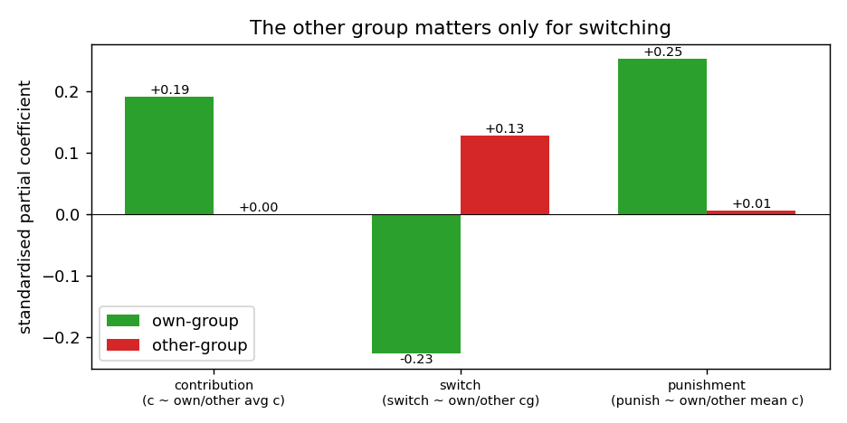

# Expressiveness of the switch and punishment AHs — group influence & own-vs-other

**Companion to** `reports/expressiveness_group_switching_contribution_50ep.md`
(the contribution AH). Same questions, same three-lens framing (representational
**capacity** / data **identifiability** / **learnability** of the trained model),
applied to two sibling models:

- **Switch predictor** —
  `configs/training/artificial_humans/switch_predictor/opt_50ep_doubled.yml`,
  target `does_switch`.
- **Punishment predictor** —
  `configs/training/artificial_humans/punishment/rnn_edge_50ep_doubled.yml`,
  target `punishment`.

All three are the same `GraphNetwork` family (fully-connected 8-node graph across
*both* groups, mean edge aggregation, RNN over rounds), so the **capacity** analysis
of the contribution report carries over verbatim — including the disentanglement
mechanism (group-typed edge channels via learned AND-gates) and its caveats
(mean-pool size weighting, soft gating, absolute-not-relational group encoding).
**This report does not repeat that; it focuses on where the qualitative story
differs — and it differs a lot.**

The one-line difference: **for contribution and punishment the other group is
irrelevant; for switching it is half the signal.**



---

## TL;DR — three models, three stories

| | Contribution | **Switch** | **Punishment** |
|---|---|---|---|
| Target | next contribution | does the player switch group | manager's punishment |
| Group feature present | `agent_group` (one-hot) | `prev_agent_group` (**numeric**) | **none** |
| Own-group effect (std β) | +0.19 (avg contribution) | **−0.23** (own common good) | **+0.25** (own mean contr., *relative*) |
| Other-group effect (std β) | +0.00 | **+0.13** (other common good) | +0.01 |
| Does the *other* group matter? | No | **Yes — it's the whole task** | No |
| Does the trained model use group identity? | No (Δ +0.0009) | No (`prev_agent_group` Δ +0.0005) | Can't — no group feature |
| Biggest gap | minor | **other-group quality under-served** | **no group info for a relative rule** |

---

## 1. Switch predictor — the other group becomes load-bearing

**Features:** `prev_common_good` (own group's per-capita pool), `prev_punishment`,
`prev_agent_group` (numeric), `round_number`. **No `prev_contribution`** — so
contributions reach this model only *through* `common_good`, which is a sufficient
statistic for a group's productivity.

### Q1 — do group contributions influence switching? **Yes, dominantly.**

Switching is driven by group *quality*, and the model is handed exactly that
signal: `prev_common_good` is by far its most important feature (shuffle Δ test
log-loss **+0.111**, vs +0.051 for punishment, +0.0005 for `prev_agent_group`,
+0.000 for `round_number`). So "how the group's contributions influence the
decision" is well covered — via common good rather than raw contribution.

### Q2 — own vs other group: **now behaviorally essential, and under-served.**

Switching *is* a between-group comparison: you leave a bad group for a better one.
The data shows exactly this structure (N = 3,332 switch decisions, switch rate
31.7%):

| | std β on `does_switch` |
|---|---|
| own-group common good | **−0.23** (worse own group → switch away) |
| other-group common good | **+0.13** (better other group → switch toward) |

The **gap** (`other − own`) is the strongest single predictor (r = +0.28), and the
two are separable (corr −0.21, even slightly *anti*-correlated — natural in a
2-group competition). So unlike contribution, here the other group carries real,
independent signal that the model **must** represent to be correct.

**The architectural tension.** The focal's *own*-group quality arrives cleanly as
the `prev_common_good` node feature. The *other* group's quality is only available
through the graph (other-group neighbours carry their group's `common_good`), and
extracting it requires the very group-gating the contribution report showed the
model does not learn — here made *worse* by `prev_agent_group` being encoded
**numeric** (a single ordered scalar, the spurious-ordering the contribution
config deliberately fixed with one-hot) **and** essentially unused (Δ +0.0005).
The likely consequence: the model captures the **"my group is bad → leave"** half
(own common good + punishment received, both well-served) but **under-uses the
"the other group is better → join"** half. That is a concrete, testable
prediction — a counterfactual that raises only the *other* group's common good
should move the switch probability less than the data's +0.13 warrants.

**Recommendation (highest-value of the three models).** Give the model the
other-group signal explicitly: an **other-group common good** node/global feature,
or directly the **gap** `other_cg − own_cg`. This is where an explicit relational
feature pays the most, because the signal is large *and* the current architecture
structurally under-serves it. (`prev_agent_group` could also be switched to
one-hot for consistency, but it is moot while unused.)

---

## 2. Punishment predictor — a relative rule with no group feature

**Features:** `prev_contribution`, `prev_punishment`, `is_first`. **No group
feature at all** (`agent_group` was deliberately dropped). So own-vs-other
disentanglement is **impossible by construction** — the edge MLP receives no tag
that distinguishes a neighbour's group.

### Q1 — do group contributions influence punishment? **Yes — and more than for contribution.**

The manager punishes *relative to the group*, not just absolutely. Standardised
OLS of punishment on own contribution + own-group mean + other-group mean
(N = 15,268):

| | std β on `punishment` |
|---|---|
| own contribution (self) | **−0.42** (low contributors punished more) |
| own-group mean contribution | **+0.25** (held to the group's standard) |
| other-group mean contribution | +0.01 |

The positive own-group-mean coefficient *controlling for self* is the signature of
a **group-referenced rule**: for a fixed own contribution, you are punished more
when your group-mates gave more (you fell behind a higher bar). This own-group
effect (+0.25) is **larger** than the contribution model's (+0.19) — the
punishment AH genuinely needs the own-group average.

### Q2 — own vs other: **moot to distinguish, but impossible to isolate.**

The other group does not affect punishment (+0.01) — each manager punishes only
their own group — so there is nothing to *separate from*. But the model still
needs the **own**-group mean in isolation to compute the relative rule, and with
no group feature its graph can only produce a **both-group blended** mean. Since
the other group is irrelevant, that blend is a biased, noise-contaminated proxy
for the quantity it actually needs. The model therefore captures the **absolute**
deterrence term (self → punishment) well, but can only approximate the
**group-relative** term it should be using.

**Timing caveat.** Punishment tracks **same-round** contribution (r −0.28) more
strongly than the **previous-round** contribution (r −0.19) the model is actually
fed. The manager reacts to *current* contributions; the supervised feature is
lagged. (The AH stack may realign this in simulation, where round-t contributions
are predicted before punishment — worth checking, but as trained the model sees a
weaker proxy.)

**Recommendation.** Re-introduce a group signal — `agent_group` (so the graph can
gate to the own group) or, more directly, an **own-group mean contribution** node
feature. Expected payoff is the **highest own-group effect of the three models**
(+0.25) against a model that currently has *zero* group information. Also worth
testing whether the manager should be conditioned on **same-round** rather than
lagged contribution.

---

## 3. Synthesis

- **Capacity** is identical across the three (same GNN); the differences are all in
  what the *task* needs and what each *config* feeds the model.
- **The other group matters only for switching** (figure above): partial effect
  ≈ 0 for contribution and punishment, but +0.13 (opposite sign to own) for the
  switch decision. Disentanglement is a nice-to-have for contribution, irrelevant
  to separate for punishment, and **central** for switching.
- **Each model is mis-provisioned for its own task:**

  | Model | Needs | Has | Fix (highest-value first) |
  |---|---|---|---|
  | Punishment | own-group mean (relative rule, β +0.25) | no group feature | add `agent_group` / own-group mean contribution |
  | Switch | other-group quality (β +0.13) | own only (direct), other via unused graph gating | add other-group common good / `gap` feature |
  | Contribution | own-group avg (β +0.19) | `agent_group` (unused) | own-group avg contribution (+ `same_group` edge) — see contribution report §7–8 |

- **Group identity is unused wherever it exists** (`agent_group` Δ +0.0009 for
  contribution, `prev_agent_group` Δ +0.0005 for switch) — consistent with the
  pair-augmentation deliberately symmetrising the absolute label. The useful group
  signal everywhere is **relational** (own vs other), not the absolute id; the
  recommended features above all provide it directly rather than asking the graph
  to learn it.

---

## Appendix — reproduce

```bash
.venv/bin/python scripts/data_analysis/expressiveness_switch_punishment.py
```

Inputs: `experiments/2group_8agent_50ep.csv` and the trained metrics parquets
under `artifacts/artificial_humans/{switch_pred_opt_50ep_doubled,
punishment_rnn_edge_50ep_doubled}/`. Output: the summary figure in
`plots/data_analysis/`. The contribution-model number (+0.19 / +0.00) in the
figure is from the contribution report §5a.
