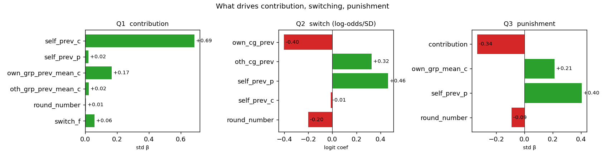
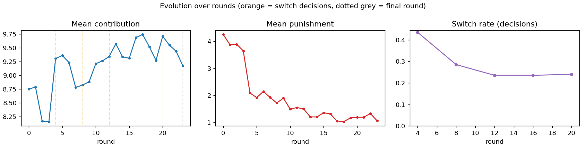
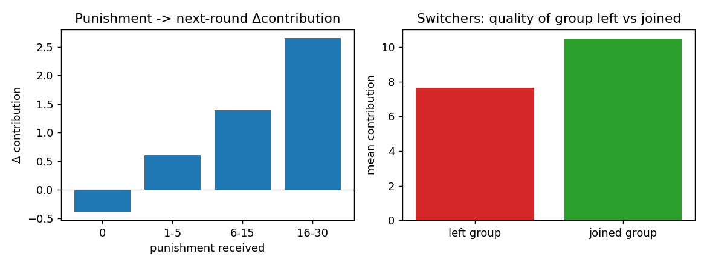

# Is human play sensible? Interpretable models of the group-switching game

**Data:** the 2-group / 8-agent / 50-episode group-switching pilot
(`experiments/2group_8agent_50ep.csv`), **de-duplicated** to the 50 real
episodes (the file stores each competition twice with group labels swapped). 24
rounds per episode; group-switch decisions at rounds 4/8/12/16/20.

**Method:** simple, *explainable* models — standardised OLS / logistic regression
(coefficients are per-1-SD, directly comparable) and a switch event-study. The aim
is understanding, not prediction. All numbers reproduce via the companion script
(Appendix).

**Bottom line: yes — human behaviour is strikingly sensible.** People are
conditional cooperators who match their own group and ignore the other; they vote
with their feet toward better groups and away from punishment; managers punish
low and group-relative contributors and ease off late; switchers adopt their new
group's norm; and the switching+punishment institution **sustains** cooperation
rather than letting it decay. A few small "irrationalities" remain (≈⅓ of switches
go to a worse group; a mild end-game dip).

| Question | Finding | Sensible? |
|---|---|---|
| Q1 contribution | conditional cooperation (own-group +0.17) + strong self-inertia (+0.69); other group ignored | ✅ |
| Q2 switching | leave low-quality groups for better ones (gap +0.57), flee punishment (+0.46), settle over time (−0.20) | ✅ |
| Q3 punishment | punish low contributors (−0.34), group-relative (+0.21), taper at end-game | ✅ |
| Q4 adaptation | switchers move toward the new group's norm (+0.18 on new peers) | ✅ |
| Q5 evolution | cooperation **rises then holds** (no classic decay); punishment falls; switching settles | ✅ |
| Punishment work? | dose-response deterrence; small but positive net of mean-reversion | ✅ (modest) |
| Switching smart? | 68% of switches go to the better-contributing group | ✅ (directionally) |



---

## Q1 — What drives contribution?

Standardised OLS, target = contribution (R² = 0.61, N = 7,870):

| predictor | std β | reading |
|---|---|---|
| own previous contribution | **+0.69** | strong persistence / self-consistency |
| own-group's previous mean | **+0.17** | **conditional cooperation** — match your group |
| just switched | +0.06 | small bump on arrival |
| other-group's previous mean | +0.02 | ≈ 0 — the other group is ignored |
| own previous punishment | +0.02 | weak |
| round number | +0.01 | ≈ flat (no decay — see Q5) |

**Sensible.** People are *conditional cooperators*: they raise their contribution
when their own group gave more last round, and they correctly **ignore the other
group** (you share the pool only with your own group). Behaviour is mostly
sticky (large self-coefficient), with social influence as a real second-order
force.

## Q2 — What drives switching?

Logistic regression at the 5 decision rounds (pseudo-R² = 0.11, N = 1,666, base
switch rate 30%); coefficients are log-odds per SD:

| predictor | coef | reading |
|---|---|---|
| own-group common good | **−0.40** | leave when your group is doing badly |
| other-group common good | **+0.32** | leave toward a better group |
| own previous punishment | **+0.46** | **flee punishment** (the single strongest push) |
| round number | **−0.20** | switch less as the game goes on |
| own previous contribution | −0.01 | not about your own giving |

A single **gap** feature (other − own common good) summarises the comparison:
**+0.57** log-odds per SD. **Sensible** — this is textbook "voting with your feet":
people leave under-performing groups for better ones and escape punishment, and
they commit more as the horizon shortens.

## Q3 — What drives punishment?

Standardised OLS, target = punishment, manager reacting to **same-round**
contributions (R² = 0.31, N = 8,359):

| predictor | std β | reading |
|---|---|---|
| contributor's contribution | **−0.34** | punish low contributors |
| own-group mean contribution | **+0.21** | **group-relative** — punished for falling below the group's bar |
| previous punishment | **+0.40** | persistence / consistent managers |
| round number | **−0.09** | ease off near the end-game |

**Sensible.** Managers target low contributors, judged **relative to the group**
(for a fixed own contribution, you are punished more when your group-mates gave
more). Punishment is consistent across rounds and tapers late, when its future
deterrent value is gone.

> Note on timing: punishment tracks **same-round** contribution (r −0.28) more
> than the previous round (r −0.19); the manager reacts to current behaviour.

---

## Q4 — How do people adapt after switching?

Event study over 547 switches: post-switch contribution regressed on the
switcher's own pre-switch level and their **new group's peers** (leave-one-out
mean at the arrival round):

| | std β |
|---|---|
| own pre-switch contribution | +0.45 |
| new group's peer mean | **+0.18** |

Raw: switchers came from a low-contributing context (**7.7**), joined a
higher-contributing group (peers **9.7**), and landed at **9.4**.

**Sensible.** Switchers **partially adopt the new group's norm** — conditional
cooperation generalises to the new peers — while their own disposition persists.
They move *up* toward the better group they chose, rather than dragging it down.

## Q5 — Evolution over rounds & end-game effects



- **Contribution rises, then holds.** After an early dip (8.8 → 8.2 by round 3),
  contribution jumps once switching opens and climbs to ~9.7 mid-game, ending at
  9.2 — a **mild** end-game dip (−0.26 on the final round; ~0.5 over the last
  block). This is the **opposite of the classic public-goods decay**: the
  switching + punishment institution appears to *sustain* cooperation.
- **Punishment falls steadily** (4.2 → ~1.1): managers punish hard early to set
  the norm, then need far less. Slight further easing at the end-game.
- **Switching settles** (43% at the first decision → 24%): heavy early sorting
  into groups, then commitment.

**Sensible.** A coherent institutional dynamic: early heavy enforcement + sorting
establishes cooperative groups; once sorted, cooperation is high and stable,
enforcement relaxes, and people stop moving. The only "irrational" trace is the
small end-game defection — and it is small.

---

## Bonus questions



**Does punishment deter?** Yes, modestly. The raw dose-response is clean and
monotonic — unpunished players drift *down* next round (−0.4), while heavily
punished ones jump *up* (+2.7 for 16–30 points). Part of that is mean-reversion
(low contributors are both punished and bounce back), but controlling for current
contribution, punishment still has a **positive** effect on the next contribution
(+0.05 SD). So punishment works, on top of the indirect channel of pushing
low-contributors out via switching (Q2).

**Is switching smart?** Mostly. In **68%** of switches the group joined was
contributing more than the group left (joined **10.5** vs left **7.7**, as of the
decision). The ~⅓ that move to a *worse* group are largely people **fleeing
punishment** (Q2) — escaping the sanction even at the cost of a less cooperative
group.

**A unifying theme — reference dependence.** Both cooperation (Q1, own-group mean
+0.17) and punishment (Q3, own-group mean +0.21) are judged *relative to the own
group*. People and managers alike evaluate behaviour against the local group
standard, not in absolute terms — a hallmark of how humans actually play these
games.

---

## Verdict — are humans sensible in this game?

**Yes, clearly.** Every channel points the right way: conditional cooperation,
own-group focus, feet-voting toward better groups, punishment-avoidance,
group-relative sanctioning that eases at the end, norm-adoption by newcomers, and
an institution that holds cooperation up instead of letting it erode. The
residual quirks — a minority of switches to worse groups (punishment flight) and a
small end-game dip — are themselves *understandable*, not random. For modelling
purposes, this is encouraging: the behaviour an artificial human needs to
reproduce is well-structured and economically interpretable.

### Caveats

- **Associational, not causal.** Coefficients are partial correlations; no
  instruments. Peer-effect estimates (Q1, Q4) carry the usual reflection problem.
- **Small sample.** 50 de-duplicated episodes; treat small coefficients
  (round in Q1, other-group in Q1) as ≈ 0 rather than precise.
- **Deterrence** is confounded with mean-reversion; the controlled estimate is the
  conservative one.
- Linear/logistic forms; genuine nonlinearities (thresholds, heterogeneous types)
  are not captured here and are a natural follow-up.

---

## Appendix — reproduce

```bash
.venv/bin/python scripts/data_analysis/human_behavior_analysis.py
```

Input: `experiments/2group_8agent_50ep.csv` (de-duplicated internally to 50
episodes). Outputs: `plots/data_analysis/human_behavior/{drivers,evolution,bonus}.png`
and all numbers above.
