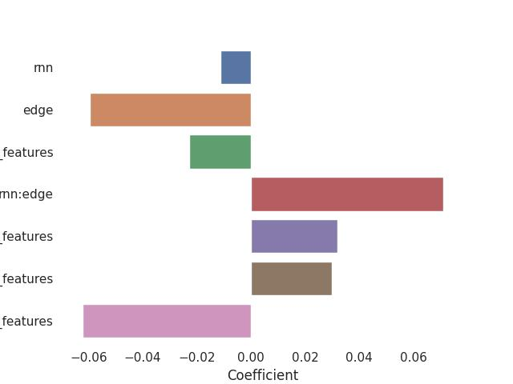
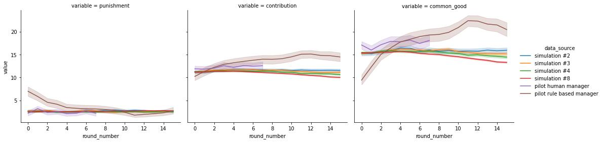

# Artificial Human Manager

We additionally build a model to mimick the behavior of human manager in the game. We reutilised the
same general architecture used for the artificial human contributors to create such artificial human manager.

We use the training hyperparameter which we found to be working well for the artificial
human participants (learning rate of 3.e-4, weight decay of 1.e-5, clamping of
gradients at 1), with the exception of the batch size, which we increased to 20.
The original batch size of 10 lead to failing convergence.

## Architecture

Evaluating the the different components of our architecture, we found that
adding an recurrent unit and round based features added little to the model
performance. And the best average performance was archived by a models without these features.

Therefore we settled on model without a recurrent unit and round based features, but that includes an edge model.

## Simulation

We simulated the 10000 groups each of 4 artificial human contributors and a artificial human manager. The simulations show relative
contribution and punishment levels that are relative stable across rounds.

We also investigate the behavior of larger and smaller groups and found relative
low deviation in both, behavior of the group as well as the behavior of the
manager. A detailed discussion of the comparision of artificial groups and real
group follows in the seciont "Comparision".

Finally, we compare the average punishments conditioned on the contribution of
the respective group member, between human manager and our human like manager
model. We found both to match within statistical errors.

