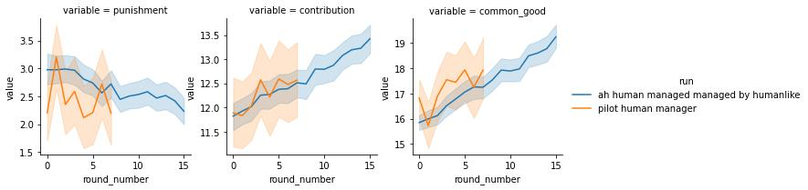
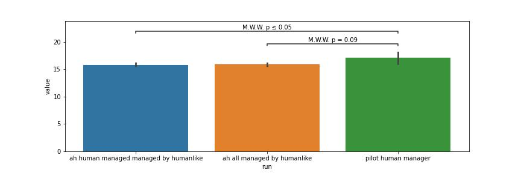

# Artificial Human Manager

We additionally build a artificial human manager to mimick the behavior of human
manager in the game using the same architecture as for the artificial human
contributors.

We use the training hyperparameter which we found to be working well for the artificial
human contributors (learning rate of 3.e-4, weight decay of 1.e-5, clamping of
gradients at 1), with the exception of the batch size, which we increased to 20.
The original batch size of 10 lead to instabilities.

## Architecture

We run a binary grid over the neural network components a) edge model and b) recurrent unit. We
found no significant improvement in performance for adding a recurrent unit and
adding a the edge model. The best average cross validated performance was
archived by a model with an node and a edge model. Therefore we settled on this
model for the artificial human manager.

## Simulation

We simulated the 500 groups each of 4 artificial human contributors and a artificial human manager. The simulations show relative
contribution and punishment levels that are relative stable across rounds.

The experimental conditions differed somewhat between the rounds recorded with human
managers and with the rule based manager. For instances the instructions were not
identically. Therefore, we cannot expect humans to behave identically in both
pilots, independently from the manager. Therefore, to be able to have a fair
test for the human like manager, we created artificial humans that where trained
on the pilot with the human manager only. We found, that the aggregated behavior of
these artificial human contributor managed by the artificial human manager
closely match the aggregated behavior in the pilot.

Finally, we compare the average punishments conditioned on the contribution of
the respective group member, between human manager and our human like manager
model. We found both to match mostly within statistical errors.

