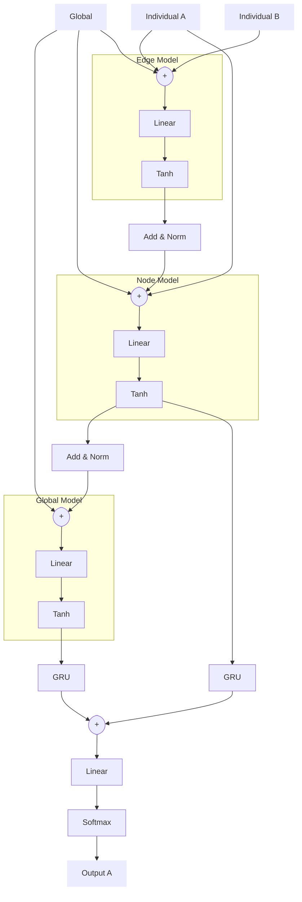

# Artificial Humans

We train 'artificial humans' that are predicting the next contribution based on historic contributions and punishments of all participants in a group. The artificial humans are modeled with neural networks which architecture we are describing in the following in greater detail. In each round, we predict a multinominal distribution over the 21 possible contributions for each of the 4 group members. We optimize the model on the cross-entropy loss. Cases in which participants do not enter a contribution are masked.

We investigated formulating the problem as a regression instead of a classification. However, shrinkage resulted in missing out on the extremes (i.e. contributions of 0 or 20). Also predicting contributions as point values does not allow to capture mixed strategies, i.e. cases in which participants in a given situation randomly decide between different contributions.

We train the models using an Adam Optimizer with a learning rate of 0.001. Gradients are clamped at absolute 1 and weights are regulized with a decay of 1.e-4. We train batches of 5 groups and full episodes.

Inputs to the model are provided at the level of the group and the individual. At the group level, the current round number and the common good of the previous round are provided. At the individual level, the contribution and received punishment of the focal agent in the previous round are provided. All inputs are scaled in the range 0 to 1.

## Neural architecture

We structure our model in three parts following recent work on graph networks (Relational inductive biases, deep learning, and graph networks). Thereby we describe the group as a fully connected graph of four nodes. Our architecture was guided by ensuring permutation symmetry in the relationship between individuals. Furthermore, we included GRUs to allow for learning temporal relationships. By placing the GRUs after aggregating pairwise interactions, we assume that temporal relationships are relevant on the global and individual level, but not at the level of pairwise relationships. The model receives global (round number and previous common good) and node features (previous contribution and received punishment). No explicit edge features are provided.

In particular, an edge model is applied to each of the 16 combinations of nodes (considering order), reflecting the 16 directed edges of the fully connected graph. For each edge, the global features are concatenated with the node features of the node pair. The resulting vector is then passed through a single layer perceptron. All resulting vectors from the same source node are averaged to a single vector.

A node model is applied to each of the 4 nodes. The output of the edge model is concatenated with the global and the node features. The resulting vector is then passed through a single layer perceptron.

A global model is applied to the full group. The output of the node model is aggregated at the group level and concatenated with the global features.

The output of the global and the node model are passed through a gated recurrent unit, concatenated and pass through a final linear layer, which then after applying a softmax operation outputs the distribution over the 21 possible contribution levels.

We use for all linear layers (except the last layer) and the GRU the same number of output units, which we denote as 'hidden units' in the following.

The learning curve of the loss of over 2000 episodes of training shows clearly an advantage of architecture including a recurrent unit, over those without. We found the best test set performance (here an average of over 6 cross-validation folds) to be a model with an edge and node model, a GRU, and no global model. We will report the detailed performance of this model in the following.

#

