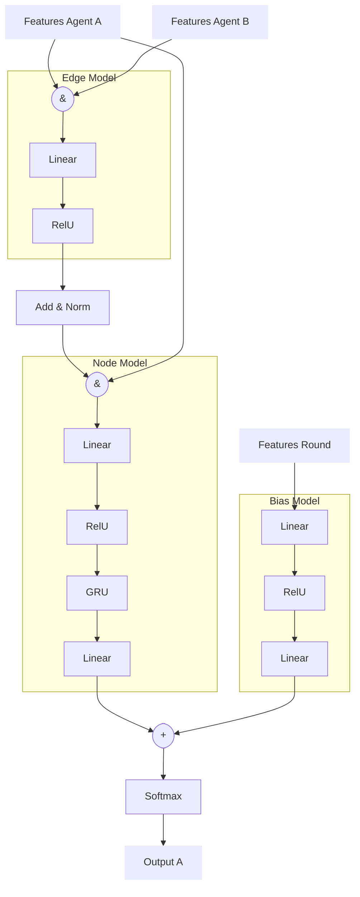
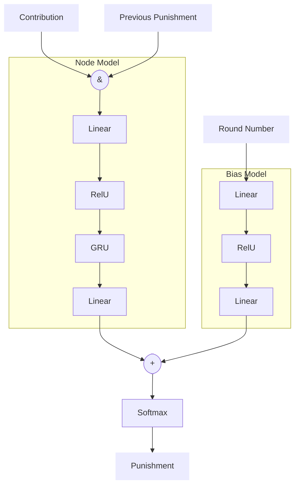

# RL Manager

We train a 'optimal manager' using deep Q learning to manage a group of
artificial humans. The manager is rewarded by the common good of the group.

## Artificial Humans environment

The artificial humans environment utilizes two independent models to represent
human behavior on this task. A `contribution model` was trained on the subset of
the data where a participants entered a valid contribution. The model predicts
the contribution of human given her own and group members previous contributions
as well as the managers punishment.

A second `valid response model` was trained on the full recorded dataset. This
model makes a binary predicition if a participants enters a valid responds.

The combined model first calculates a potential contribution for all group
members using the `contribution model` and then mask those contributions as
invalid (and replaces the corresponding values with a default), that has been
predicted to be invalid by the `valid response model`.

The environment then also computes collective values such as the common good and
keeps track of the game rounds. Importantly, an environment step, does not
align with a round in the game. An environment step starts with the punishment
of the group members. Then the contribution of the group members and the common
good for the next round is calculated.

A reward is calculated, that is composed of the punishment and next rounds
contribution.

$$
R_i = C_{i+1} * 1.6 - P_{i}
$$

Note that the contribution of the first round does not directly enter the reward
function. Also in the last round the reward is simply the negative punishment of
the manager.

However, the first contribution is causally independent from the policy ${\pi}$.
For this reason the optimal policy for the reformulated rewards, remains the
optimal
policy for maximising the common good.

$$
arg max_{\pi} \sum_i R_i = arg max_{\pi} \sum_i (C_i * 1.6 - P_i)
$$.

## Manager architecture

We reutalize the same general architecture used for the artificial humans also
for the optimal manager. There is one important difference. In Deep Q learning,
the output of the action-value network is not the policy i.e. probability of taking
an action, but the Q-value of the different potential actions. In our task,
especially for $\gamma = 1$, the Q-value depends strongly on the round number as
the possible maximal future cummulative rewards decreases from round to round.

We found empirical, that adding a onehot encoded round number as input to the
action-value model stabilzes the training and explosion of the action value
network. This solution is somewhat unsatisfing, as it inflates the weights in
the first layer and might lead to overfitting. Therefore we removed the round
number from the features of the main model, but added a second additive bias
that is derived from the round number. The bias is soley contingent on the round
number and therefore does not allow for any interaction between round and
participants behavior.

The gated recurrent unit within the behavioral part of the model on the other
hand, allows implicitly for such temporal evolutions of the the optimal policy.

## Technical Details

We vectorized the environment. For playouts we run batches containing 1000
groups of 4 group members each in parallel. We repeated games of 16 rounds.
After each full game we do one update step of the action-value network, based on
a single randomly sampled batch from a replay memory. The least parsimonious
model uses as input features the contribution of each player, the previous
punishments, the round number and the previous common good.

## Features

## Technical Exploration

### Memory and target update

We investigated the effect of the size of the replay memory and the period of updateing the target network.

The replay memory size has a relative minor influence on the training dynamic.
The target update frequency on the other hand, has clear manifistations in the
evolution of the Q-values over the training period. A frequent updates lead
to fluctuations of the q-values in early in the training. A very large update
period leads to a slow convergence and a step like increase of the q-values as future rewards a slowly propagated to earlier actions. We therefore choose an
intermediate update period of 100 training steps. For the replay memory size we
likewise choosed 100 training steps.

### Neural Units

To simply parametrisation we are using the same number of neural units
throughout the model in each layer. We investigated the different number of
neural units and found a sweat spot for 20 hidden units.

### Off-Policy Sampling

We utilze an epsilon-greedy sampling approach. We found results to be relative
insensitive towards the sampling frequency $\epsilon$. We choose $\epsilon = 0.1$.

### Neural Architecture

The previous analysis was performed with a full model as specified previously.
We also investigated the importance of individual components of the neural
architecture. The recurrent unit has a strong influence on the performance of
the manager. On the other hand, neither the edge model nor adding group
level features, such as the round number and the previous common good, has a
significant effect on manager performance. This suggest that the optimal
strategy can be computed based on the contributions of the to punish participant
only.

Correspondingly, we selected for the RL based manager a model with recurrent
units, but without edge model and without group level features.

### Selected architecture

### Simulations

We simulated the 10000 groups with the RL manager managing a artificial humans.

Punishments in the first rounds are significantly higher for the RL manager then
for both the human
manager and the rule based manager. However,
contributions are raising quickly. Thereby in later rounds, the RL manager
appears to punish less then the other two manager. Correspondingly, the common
good is raising up to 30, while it remains at around 18 and 20 for the human and
rule based manager respectivly.

The RL manager is on average punishing considerable more for the same level of
contribution in comparision to both, the human and the rule based manager.

We also investigated how this relationship develops over the 16 rounds. It can
be shown, that the RL is relative forgiving in the first round. In the then
following rounds it appears to be particular strict. Sometimes punishing up to
10 coins for a contribution of 17 coins (just 3 less then the maximum). Then
towards the end of the game, the manager is again much more forgiving with a
contribution of 10 coins only resulting in a punishment of 4 coins.

Finally, we investigate how the policy depends on the previous mean contribution of the
artificial human. The following plot shows the relationship between contribution
and punishment of round 8 to 12. The color code indicates the mean previous
contribution. We find that the RL manager is more strict (higher punishments)
with artificial humans that had higher previous contribution.

