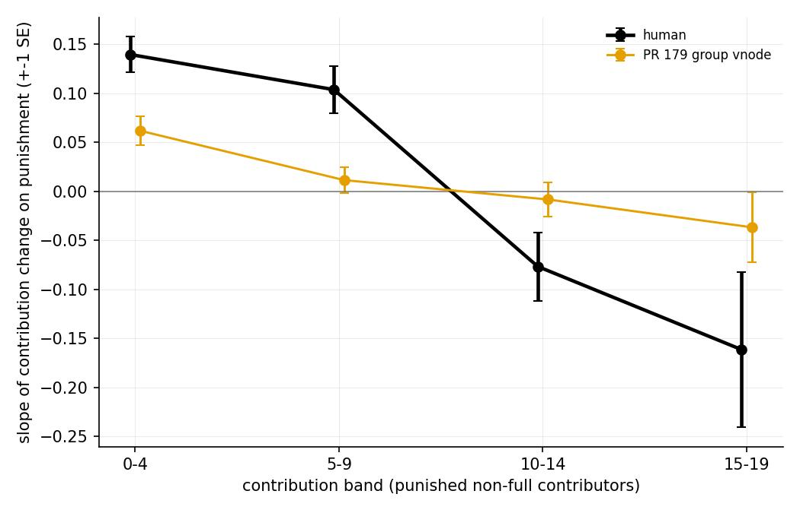

# RCB vs RCE: a punishment-response row that measures the mechanism

Branch `rcb-alternative-response-slope`. Numbers recomputed with the evaluation suite on `experiments/2group_8agent_50ep.csv` and on the committed `per_round.parquet` of every stack listed below (500 resampling repeats, master seed 42, the same plan for every row). Scripts: scratchpad `compare_fast.py` (an exact per-episode sufficient-statistics replica of `scoring.score_row`, checked against the sweep's `score_matrix.csv` to 0.005) and `reference_models.py`. Tables: `plots/data_analysis/evaluation/rcb_alternative/`.

## Motivation

RCB scores the mean next-round contribution change of punished non-full contributors by punishment-rate bin, rate = punishment / (20 − contribution). The rate mixes contribution level and punishment dose: a rate above one is reached by a zero contributor punished 20 and by a 17 contributor punished 4. In a joint human regression dc ~ contribution + punishment + rate the rate coefficient has the wrong sign, so the monotone bin profile is a composition artefact of level and dose, and bin means can be matched without any within-level response: the categorical-contributor stacks post the best RCB in the sweep while their within-band slopes point the wrong way. The mechanism the project needs, because punishment is the RL manager's only lever, is the conditional response: at a given contribution level, how the next-round change depends on the punishment received. RCE scores exactly that.

## Definitions

**RCE -- punishment response slope.** Population: RCB's -- punished (punishment > 0) non-full (contribution < 20) contributors with a valid next-round contribution change dc = c_{t+1} − c_t of the same participant. Statistic: per contribution band 0-4, 5-9, 10-14, 15-19, the OLS slope of dc on punishment received. Discrepancy: human-frequency-weighted mean |Δ slope| over the four bands (kind `statistic`, so `scoring.py`'s resampling ceiling applies unchanged); a band with no rows or with no dose variation has no slope and counts as empty, which drops the repeat as for every R row. Implemented as `ResponseMetrics.rce` / `rce_weights` / `_rce_fit` (slope, standard error, n per band) with `RCE_EDGES` / `RCE_LABELS`; figure `RCE_line` in `visuals.py`; definition in `notes/evaluation_metric_defs.md`; tests in `test_eval_metrics.py`.

**Why the unpunished are left out.** The brief proposed including unpunished rows as the zero-dose anchor. On the human data that anchor sits off the line: in every band the observed mean dc at punishment 0 is well below the intercept of the regression fitted on the punished rows (0-4: 0.87 vs 1.24; 5-9: 0.04 vs 0.72; 10-14: −0.52 vs 0.72; 15-19: −1.12 vs −0.76). Being punished at all shifts dc up by 0.4 to 1.2 points in every band, including the bands where more punishment then lowers dc. Pooling the unpunished rows blends that extensive-margin step into the dose slope: the all-rows slopes are +0.157 / +0.153 / +0.028 / −0.127, and the 10-14 band flips sign. The punished-only population also makes RCE and RCB two statistics of the same rows, so the comparison below isolates the statistic, and its ceiling is no worse (0.0860 vs 0.0848 for all rows). The all-rows variant was scored as a sensitivity check (`RCE_all` in `comparison_table.csv`): rank correlation with the punished-only RCE 0.93 across the 40 stacks. The extensive margin is a mechanism of its own (RCC's contrast, per band) and could be a separate row.

**RCF -- punishment response cells** (the optional second candidate): the same population cut into (contribution band x punishment bin 1-3, 4-9, 10+) cells, mean dc per cell, weighted |Δ| over the 12 cells. Implemented as `rcf` / `rcf_weights`; no figure.

## Human reference

| band | n | RCE slope | SE |
|---|---|---|---|
| 0-4 | 965 | +0.140 | 0.018 |
| 5-9 | 929 | +0.104 | 0.024 |
| 10-14 | 560 | −0.077 | 0.035 |
| 15-19 | 206 | −0.161 | 0.079 |

Low contributors comply, high contributors withdraw. RCF cell means run 1.28 / 2.17 / 3.77 in 0-4 and −0.86 / −1.54 / −4.50 in 15-19 (the last cell has 20 rows).

## Noise ceilings (human vs human, 500 repeats, seed 42)

| row | ceiling d(h_a, h_b) | repeats used | zero response | half-strength response | sign-flipped response |
|---|---|---|---|---|---|
| RCB | 0.348 | 500 | 3.64 | 1.83 | 7.27 |
| RCE | 0.0860 | 500 | 1.42 | 0.82 | 2.74 |
| RCF | 0.593 | 499 | 2.56 | 1.35 | 5.04 |
| RCE, all rows (variant) | 0.0848 | 500 | | | |
| RCE, 2 bands 0-9 / 10-19 (variant) | 0.0602 | 500 | 2.15 | | 4.23 |

The last three columns are the scores of synthetic responses: every stratum set to 0, to half the human value, and to minus the human value (numerator d(h_a, synthetic) over the same repeats). They calibrate what a score means. The human slopes are noisy at 25 games per half: the per-band |Δ| between two human halves is 0.052 / 0.083 / 0.095 / 0.236, two to three times the OLS standard errors, because responses cluster by game and a few heavily punishing games carry the leverage. As a consequence RCE's ceiling is large relative to the effect: a model with no punishment response at all scores 1.42 ("minor deviation"), and a model with half the human response scores 0.82, at the ceiling. RCB is far more sensitive to the same synthetic cases, but that sensitivity is to the level of dc among punished players, not to the dose response (see the cat stacks below). The two-band variant halves the gap: no response scores 2.15, a sign flip 4.23, and it ranks the 40 stacks the same way as the four-band row (Spearman 0.95).

## Comparison across stacks

Scores are multiples of the row's ceiling; d is the raw discrepancy on the full data. Slopes are the stack's RCE statistics; the sign column compares them band by band with the human pattern ++−− (a near-zero slope of the right sign counts as a match, so read it together with the magnitudes).

| model | RCB d | RCB score | RCE d | RCE score | RCF score | RCE-2band score | slopes 0-4 / 5-9 / 10-14 / 15-19 | signs vs human |
|---|---|---|---|---|---|---|---|---|
| PR 179 group vnode | 0.797 | 2.32 | 0.0846 | 1.10 | 1.31 | 1.78 | +0.062/+0.012/-0.008/-0.037 | ++-- (4/4) |
| PR 179 no-copula ablation | 0.745 | 2.17 | 0.0906 | 1.17 | 1.33 | 1.77 | +0.054/+0.004/-0.028/+0.026 | ++-+ (3/4) |
| PR 181 stimulus skip | 0.718 | 2.09 | 0.0584 | 0.91 | 1.22 | 1.29 | +0.073/+0.054/-0.047/-0.025 | ++-- (4/4) |
| PR 171 joint exodus | 0.689 | 2.02 | 0.0950 | 1.18 | 1.35 | 1.77 | +0.037/+0.025/+0.010/-0.006 | +++- (3/4) |
| PR 170 gmlp group copula | 0.620 | 1.91 | 0.0485 | 0.84 | 1.14 | 1.31 | +0.110/+0.024/-0.120/-0.169 | ++-- (4/4) |
| PR 172 joint exodus on gmlp | 0.711 | 2.10 | 0.0518 | 0.89 | 1.14 | 1.37 | +0.079/+0.041/-0.105/-0.182 | ++-- (4/4) |
| PR 174 k one-hot | 0.620 | 1.91 | 0.0462 | 0.83 | 1.11 | 1.34 | +0.103/+0.037/-0.116/-0.174 | ++-- (4/4) |
| PR 177 inflated gmlp | 0.458 | 1.46 | 0.0645 | 0.99 | 1.15 | 1.40 | +0.033/+0.061/-0.051/-0.231 | ++-- (4/4) |
| main gnn x gnn x gnn | 0.635 | 1.89 | 0.0744 | 0.99 | 1.08 | 1.40 | +0.090/+0.021/-0.005/-0.000 | ++-- (4/4) |
| main gnn x gnn x gaussian | 0.781 | 2.27 | 0.0663 | 0.94 | 1.07 | 1.27 | +0.060/+0.045/-0.028/-0.075 | ++-- (4/4) |
| main gnn x gnn x multinomial | 0.616 | 1.93 | 0.0847 | 1.09 | 1.22 | 1.61 | +0.062/+0.043/+0.047/-0.042 | +++- (3/4) |
| main gnn x gnn x ridge | 0.865 | 2.52 | 0.1030 | 1.34 | 1.26 | 1.97 | +0.016/+0.018/-0.009/+0.018 | ++-+ (3/4) |
| main gnn x lin x gnn | 0.644 | 1.96 | 0.0478 | 0.88 | 1.09 | 1.13 | +0.137/+0.029/+0.007/-0.123 | +++- (3/4) |
| main gnn x lin x gaussian | 0.660 | 1.96 | 0.0238 | 0.67 | 0.95 | 0.83 | +0.132/+0.073/-0.033/-0.152 | ++-- (4/4) |
| main gnn x lin x multinomial | 0.607 | 1.83 | 0.0723 | 1.02 | 1.10 | 1.46 | +0.065/+0.030/-0.002/-0.113 | ++-- (4/4) |
| main gnn x lin x ridge | 0.790 | 2.30 | 0.1013 | 1.36 | 1.26 | 1.82 | -0.005/+0.060/+0.038/-0.043 | -++- (2/4) |
| main cat x gnn x gnn | 0.543 | 1.70 | 0.1410 | 1.70 | 1.35 | 2.53 | +0.000/-0.005/+0.081/+0.084 | +-++ (1/4) |
| main cat x gnn x gaussian | 0.708 | 2.16 | 0.1389 | 1.67 | 1.43 | 2.43 | -0.017/-0.019/+0.024/+0.070 | --++ (0/4) |
| main cat x gnn x multinomial | 0.541 | 1.64 | 0.1263 | 1.55 | 1.27 | 2.26 | -0.010/+0.023/+0.047/+0.070 | -+++ (1/4) |
| main cat x gnn x ridge | 0.685 | 2.03 | 0.1477 | 1.78 | 1.33 | 2.54 | -0.009/-0.021/+0.081/+0.055 | --++ (0/4) |
| main cat x lin x gnn | 0.669 | 1.99 | 0.1307 | 1.58 | 1.28 | 2.38 | -0.005/+0.013/+0.052/+0.091 | -+++ (1/4) |
| main cat x lin x gaussian | 0.642 | 1.94 | 0.1339 | 1.61 | 1.26 | 2.32 | -0.002/-0.005/+0.058/+0.047 | --++ (0/4) |
| main cat x lin x multinomial | 0.667 | 1.95 | 0.1426 | 1.73 | 1.32 | 2.48 | -0.018/+0.037/+0.123/+0.094 | -+++ (1/4) |
| main cat x lin x ridge | 0.634 | 1.86 | 0.1209 | 1.48 | 1.11 | 2.26 | +0.041/-0.003/+0.067/+0.063 | +-++ (1/4) |
| main gaussian x gnn x gnn | 0.856 | 2.54 | 0.1086 | 1.39 | 1.44 | 2.08 | +0.033/-0.043/-0.031/-0.044 | +--- (3/4) |
| main gaussian x gnn x gaussian | 0.915 | 2.64 | 0.0875 | 1.18 | 1.30 | 1.57 | +0.027/+0.011/-0.053/-0.041 | ++-- (4/4) |
| main gaussian x gnn x multinomial | 0.855 | 2.50 | 0.0954 | 1.30 | 1.41 | 1.94 | +0.040/-0.037/-0.055/-0.092 | +--- (3/4) |
| main gaussian x gnn x ridge | 0.939 | 2.71 | 0.1172 | 1.50 | 1.27 | 2.06 | -0.035/+0.003/-0.044/-0.014 | -+-- (3/4) |
| main gaussian x lin x gnn | 0.821 | 2.43 | 0.0891 | 1.17 | 1.31 | 1.71 | +0.045/-0.004/-0.022/-0.087 | +--- (3/4) |
| main gaussian x lin x gaussian | 0.844 | 2.47 | 0.0978 | 1.28 | 1.23 | 1.76 | +0.034/-0.026/-0.038/-0.084 | +--- (3/4) |
| main gaussian x lin x multinomial | 0.848 | 2.48 | 0.1060 | 1.36 | 1.42 | 1.91 | +0.038/-0.037/-0.004/-0.103 | +--- (3/4) |
| main gaussian x lin x ridge | 0.867 | 2.53 | 0.0983 | 1.28 | 1.28 | 2.06 | +0.071/-0.043/-0.010/-0.060 | +--- (3/4) |
| main ridge x gnn x gnn | 0.856 | 2.64 | 0.1208 | 1.49 | 1.56 | 2.35 | -0.000/-0.029/-0.018/-0.019 | ---- (2/4) |
| main ridge x gnn x gaussian | 0.971 | 2.80 | 0.1278 | 1.58 | 1.56 | 2.25 | -0.035/-0.013/-0.025/+0.004 | ---+ (1/4) |
| main ridge x gnn x multinomial | 0.898 | 2.62 | 0.1243 | 1.55 | 1.59 | 2.33 | -0.007/-0.044/-0.027/-0.048 | ---- (2/4) |
| main ridge x gnn x ridge | 0.977 | 2.81 | 0.1304 | 1.62 | 1.38 | 2.15 | -0.062/+0.014/-0.002/-0.029 | -+-- (3/4) |
| main ridge x lin x gnn | 0.836 | 2.56 | 0.1143 | 1.42 | 1.48 | 2.15 | +0.001/-0.009/-0.008/-0.029 | +--- (3/4) |
| main ridge x lin x gaussian | 0.908 | 2.66 | 0.1255 | 1.54 | 1.41 | 2.41 | +0.007/-0.041/+0.001/-0.024 | +-+- (2/4) |
| main ridge x lin x multinomial | 0.904 | 2.64 | 0.1131 | 1.40 | 1.51 | 2.11 | +0.010/-0.022/-0.012/-0.052 | +--- (3/4) |
| main ridge x lin x ridge | 0.897 | 2.62 | 0.1177 | 1.46 | 1.42 | 2.32 | +0.021/-0.032/+0.005/-0.032 | +-+- (2/4) |

Figures: `plots/data_analysis/evaluation/rcb_alternative/RCE_human_vs_pr179.jpg` (the RCE row's figure for human vs PR 179, +-1 SE), `RCB_human_vs_pr179.jpg` (RCB's figure for the same pair), `RCE_human_vs_four_stacks.jpg` / `RCB_human_vs_four_stacks.jpg` (PR 179, PR 177, cat x gnn x multinomial, gnn x gnn x multinomial), and `RCB_vs_RCE_scores.jpg` (the 40 stacks in the RCB x RCE score plane).

## Rank correlation

Spearman correlations of the scores across the 40 stacks: RCB vs RCE **0.28** (p = 0.08); within the 32 sweep stacks 0.11, within the 8 PRs 0.41. RCB vs RCF 0.65, RCE vs RCF 0.65. RCB vs the number of bands with the human sign −0.08 (none); RCE vs that count −0.88 (a better RCE score goes with more correct signs, as it should). RCB and RCE are close to independent rankings of the same stacks: RCB is composition, RCE is mechanism. RCF sits halfway and adds nothing either does not say better.

## Where they disagree, and why

**The cat stacks: best RCB, worst RCE.** The eight categorical-contributor stacks hold three of the five best RCB scores (1.64, 1.70, 1.86) and sit at RCE ranks 27 to 40 (1.48 to 1.78, two-band 2.26 to 2.54), sharing the bottom of the table only with the ridge contributor. Their slopes are ~0 in 0-4 and 5-9 and *positive* in 10-14 and 15-19 (+0.05 to +0.12 where humans are −0.08 and −0.16): the categorical contributor has no compliance at low levels and reacts to punishment at high levels by giving *more*, the opposite of the human withdrawal. It matches RCB's bin means because its mean dc among punished players is right in level, and the rate bins do not look inside a level. RCB grades this as the best punishment response in the sweep; RCE places it last, with 0 or 1 of 4 signs right.

**The gmlp chain (PRs 170, 172, 174): mid-pack RCB, at-ceiling RCE.** RCB 1.91 to 2.10 (ranks 7 to 18 of 40), RCE 0.83 to 0.89 (ranks 2, 3, 5). Their slopes are the closest to human anywhere on the frontier (+0.10 / +0.03 / −0.12 / −0.17 for PR 174), all four signs right and the upper-band magnitudes at or above human. Their RCB deficit is composition: 14% of their RCB population sits in the 15-19 band (human 7.7%), which pulls the top rate bin's mean to −1.06 against the human +2.01 (the investigation's decomposition: the human response at the sim's composition is 0.36, the sim's response at the human composition 0.20).

**PR 177 inflated gmlp: best RCB on record, average RCE.** RCB 1.46 is the only score below 1.5, but RCE says 0.99 (rank 9) with a 0-4 slope of +0.033, a quarter of the human +0.140, and an overshooting 15-19 slope of −0.231. The inflation moved RCB by shifting the population and the level, not by restoring the low-level compliance; the two-band score (1.40) is no better than the parent's (1.34).

**PR 179 vs PR 181, and the GNN chain.** RCB read the stimulus skip as a near miss (2.32 to 2.09, a fail by 4.3% of the band edge); RCE reads it as a band change (1.10 to 0.91, two-band 1.78 to 1.29): the skip did strengthen the mechanism in the three lower bands (+0.062 / +0.012 / −0.008 to +0.073 / +0.054 / −0.047). Likewise the RCB downgrade that PR 179 was allowed to buy (2.02 to 2.32, from PR 171) was not a mechanism loss: PR 171's slopes are +0.037 / +0.025 / +0.010 / −0.006 (RCE 1.18), PR 179's are marginally better (1.10). On the GNN chain the mechanism was never there -- every stack's slopes are 30 to 60% of human -- and RCB's movements along it were composition.

**The punisher matters in closed loop.** The same GNN contributor gets a 0-4 slope of +0.06 under the multinomial punisher and +0.13 under the gaussian or GNN punisher with the lin switch model (gnn x lin x gaussian is the best RCE of all, 0.67, with all four signs right and human-sized magnitudes). RCE, like RCB, is a property of the stack: which punisher supplies the doses changes both the leverage and the states at which the contributor is probed. Note that the gaussian and ridge punishers are themselves far off (PA 5.7 to 7.2), so this is a caution on attribution, not a recommendation.

**What no stack has.** No stack reaches the human 0-4 slope (best +0.137) and only the gmlp chain (−0.17 to −0.23) and the gnn x lin stacks (−0.11 to −0.15) reproduce the withdrawal at the top. The sweep's gaussian and ridge contributors are flat or nearly so everywhere (|slope| ≤ 0.11, most under 0.05); their "3/4 signs" are zeros of the right sign.

## Power

RCE is the honest instrument but a blunt one under the current schema. Its human-vs-human ceiling (0.086) is 74% of the weighted mean human slope magnitude (0.116), so the whole sweep lands between 0.67 and 1.78 -- nothing ever reaches "clear deviation", not even the cat stacks with inverted responses, and a model with half the human response scores at the ceiling. The band structure that autoresearch's gates rely on (≤ 1 / 1-2 / 2-5) therefore has only one usable edge on RCE, at 1. The two-band variant (0-9 / 10-19; ceiling 0.060; no-response 2.15, sign-flip 4.23) keeps the same ranking (0.95 with the four-band row) and puts the cat stacks at 2.3-2.5 and the flat GNN chain at 1.8, with the gmlp chain at 1.3-1.4; it is the better-powered choice if RCE is to gate. RCF is dominated: its cells are thin (one human split of 500 cannot fill 15-19 x 10+), and it correlates equally with RCB and RCE without separating the two failure modes.

## Recommendation

1. **RCE beside RCB, not instead of it.** They measure different things and are nearly uncorrelated across the stacks. RCB (level and composition of the reaction among the punished) still matters for an RL manager, whose outcomes depend on how much the punished move on average; RCE is the conditional dose response the manager's policy gradient acts on. Replacing RCB by RCE would let a stack lose the level entirely while keeping a slope; keeping only RCB is what let the cat stacks and the composition-driven PRs pass as good punishment responses.
2. **Make RCE a protected row in `notes/autoresearch.md` §2**, the first one: a candidate may not worsen RCE's band, and a declared punishment-response experiment must be judged on RCE, not RCB. Given RCE's compression this is a weak brake as scored (the only edge in play is 1.0), so the protection should be stated on the statistic as well: no band may lose the human sign, and no band's slope magnitude may fall below half of the baseline's. The RCB history of the frontier (three accepted downgrades) would have looked different under this rule -- and PR 181, the only experiment that ever targeted the mechanism, would have been a success.
3. **Consider the two-band form** if the maintainer wants RCE to carry band gates on its own; the four-band row is the one implemented here because it is the statistic the investigation validated and the figure people will read. Both are one `RCE_EDGES` change apart.
4. **Do not add RCF** as a scored row; it is implemented on this branch as a candidate and can be dropped by removing its `KINDS` entry, its two methods and its test.
5. Adding rows changes the 21-row mean that autoresearch's second gate uses; the maintainer should refresh the score matrix (`evaluation_sweep.py`) once the row set is settled, since only the maintainer refreshes it.
