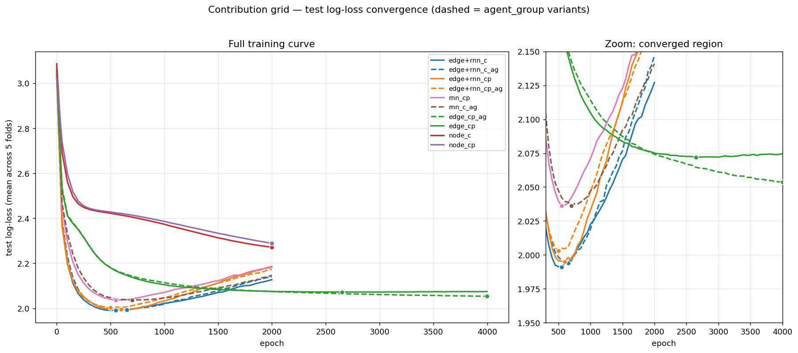

# Regularization recommendation — contribution AH (edge + RNN overfitting)

**Context.** The contribution-AH grid below shows the edge + RNN model reaching
the best test log-loss (~1.99) early, then overfitting hard. Question: which
regularizer — **dropout, weight regularization, or early stopping**?

**Recommendation in one line:** add **weight decay targeted at the RNN** (switch
to AdamW), **keep the early stopping you already have**, and **do not use
dropout** here.



> Note: this plot is from the *previous* grid (variant names `mn_*`, `node_*`,
> `edge_cp` are not the current production config), so treat the exact
> 1.99 / 2.07 numbers as indicative. The mechanism conclusion holds regardless.

---

## 1. Diagnosis — the RNN is both the value and the problem

| Variant | Behaviour | Reading |
|---|---|---|
| `edge+rnn` (blue/orange) | dips to **~1.99** at epoch ~500–700, then climbs to ~2.12 | best model, but **overfits hard** |
| `edge_cp` — edge, **no RNN** (green) | **flat at ~2.07** out to 4000 epochs | stable, higher floor — the no-RNN control |
| `node_c/cp` — no edge/RNN (red/purple) | still descending at 2000, stuck ~2.27 | **underfits** — capacity is needed |

Two facts fall out of this and drive the whole recommendation:

1. **The model needs the edge + RNN capacity** — node-only is far worse. So the fix
   must *not* be blunt capacity reduction.
2. **Essentially all the overfitting is the GRU.** The no-RNN green curve is the
   control: same edge model, no recurrence, and it does not overfit at all. The
   GRU is memorizing episode-specific temporal trajectories (16–24 rounds per
   episode, only ~100 episodes). **The cure should target the recurrent weights.**

---

## 2. Primary fix — weight decay on the RNN (AdamW)

Weight regularization is the right tool because it attacks the actual mechanism
(large recurrent weights) and, unlike early stopping, can **flatten the
post-minimum rise *and* lower the floor** rather than just truncating training.

It is also nearly free to try — the knob already exists but is effectively off:

```yaml
# configs/.../group_switching_contribution_50ep.yml
optimizer_args:
  lr: 3.e-4
  weight_decay: 1.e-5     # <-- negligible; this is the lever
```

**Action items (in order):**

1. **Sweep `weight_decay ∈ {1e-4, 3e-4, 1e-3}`** and compare the 5-fold CV
   minimum against the current ~1.99.
2. **Switch `Adam → AdamW`** in `train.py:206`. The current
   `th.optim.Adam(weight_decay=…)` folds L2 into the adaptive update, which
   weakens it; AdamW applies *decoupled* decay, which is what makes weight decay
   actually regularize:
   ```python
   # src/aimanager/artificial_humans/train.py:206
   optimizer = th.optim.AdamW(model.parameters(), **optimizer_args)
   ```
3. **(Surgical option) Higher decay on the GRU only.** Since the GRU is the
   culprit, put it in its own parameter group with a larger decay than the
   edge/readout layers:
   ```python
   rnn_params  = [p for n, p in model.named_parameters() if "rnn" in n]
   other_params = [p for n, p in model.named_parameters() if "rnn" not in n]
   optimizer = th.optim.AdamW([
       {"params": rnn_params,  "weight_decay": 1e-3},
       {"params": other_params,"weight_decay": 1e-5},
   ], lr=optimizer_args["lr"])
   ```

**Expected outcome:** the sharp rise after the minimum flattens toward the green
curve's stability, ideally at a floor at or below 1.99.

---

## 3. Keep early stopping — it is the free safety net (already in place)

The test curve is a clean, reproducible U (minima cluster at ~500–700 across
folds), and the pipeline **already supports it** (`early_stopping_patience` in
`train.py`); the production config already caps at **575 epochs**, which is the
right call. Keep it.

But understand its limit: early stopping only **captures** the existing 1.99 — it
cannot push below it. Use it as a backstop alongside weight decay, not as the
regularization strategy itself.

---

## 4. Do **not** use dropout here

Worst fit of the three for this architecture:

- The GRU is **single-layer** (`num_layers=1`, `graph.py:160`), so PyTorch's
  built-in `GRU(dropout=…)` does **nothing** — it only drops *between* layers.
  Regularizing the recurrence requires hand-rolled **variational/recurrent
  dropout** (a shared mask across timesteps); naive per-timestep dropout corrupts
  exactly the temporal signal the GRU exists to learn.
- Width is **20**; each unit is ~5% of capacity, so dropout is coarse and
  high-variance at this size.
- `node_*` already shows the model near the **underfitting** edge — stochastic
  capacity reduction risks turning overfit into underfit, at the highest
  implementation cost of the three.

---

## 5. Plan + fallback

| Step | Change | Validate on |
|---|---|---|
| 1 | `Adam → AdamW` | 5-fold CV test log-loss |
| 2 | sweep `weight_decay` {1e-4, 3e-4, 1e-3} | CV minimum vs 1.99 |
| 3 | (optional) GRU-only param group with higher decay | does the rise flatten? |
| keep | 575-epoch early stop as backstop | — |

**If weight decay alone cannot beat 1.99,** the fallback capacity knob is width —
see §6.

---

## 6. Capacity — should we change `hidden_size`?

Short version: **don't increase it; decreasing is reasonable but blunt — prefer
weight decay.** `hidden_size` is the wrong-resolution knob because, in this
architecture, it sizes the **edge model, the node hidden, and the GRU all at
once** (`graph.py`). The overfit lives in the GRU; the edge model is doing real
work (it's why `edge+rnn` beats `node_*`). So any global width change drags the
useful edge capacity along with the harmful GRU capacity.

**Increasing — no.** The problem is *overfitting* (variance), and width adds
variance. Worse, it scales the GRU, the exact overfit source. The `node_*`
underfitting is about missing edge/RNN *structure*, not narrow width — that
inductive bias is already present. And the ~1.99 floor (vs ln 21 ≈ 3.04 for
uniform) looks data/noise-limited on ~100 episodes, so more capacity has little
to buy. Only worth a *single* diagnostic arm (e.g. hidden 40 **with strong
decay**) to confirm the floor isn't bias-limited; expectation: it won't move.

**Decreasing — reasonable, but coarse.** It does reduce variance (right
direction). The likely payoff is **not a lower floor but a flatter, more robust
curve** — less sensitive to the exact early-stop epoch — since width-20 is
already a bit rich for ~100 episodes. But a global cut also shrinks the edge
model, risking trading GRU-variance for edge-bias.

**Preference order (capacity control):**

1. **Weight decay on the GRU (AdamW)** — continuous and *targetable* (param group
   on the GRU only), so it shrinks the culprit without touching the edge model.
2. **Quick `hidden_size ∈ {10, 15, 20}` sweep** — cheap; pick the smallest width
   that holds ~1.99 with a flat curve (Occam / robustness check).
3. **Decouple + shrink the GRU only** — the clean version of #2: give the GRU its
   own `rnn_hidden_size` (small change in `graph.py`, currently it reuses
   `hidden_size`) and reduce just that, leaving edge/node capacity intact.
4. **Increasing width** — no.

**More promising than either direction:** add *signal*, not capacity. The
own-group average-contribution feature (+0.027 R² in the expressiveness report)
gives the model something new to fit; width only refits what it already has.

---

**Summary:** weight decay (AdamW, RNN-focused) is the regularizer to add; early
stopping stays as free insurance; dropout is not worth it for a single-layer,
width-20 GRU; and on `hidden_size` — don't increase it, and only shrink it (ideally
the GRU alone) as a secondary robustness check after weight decay.
