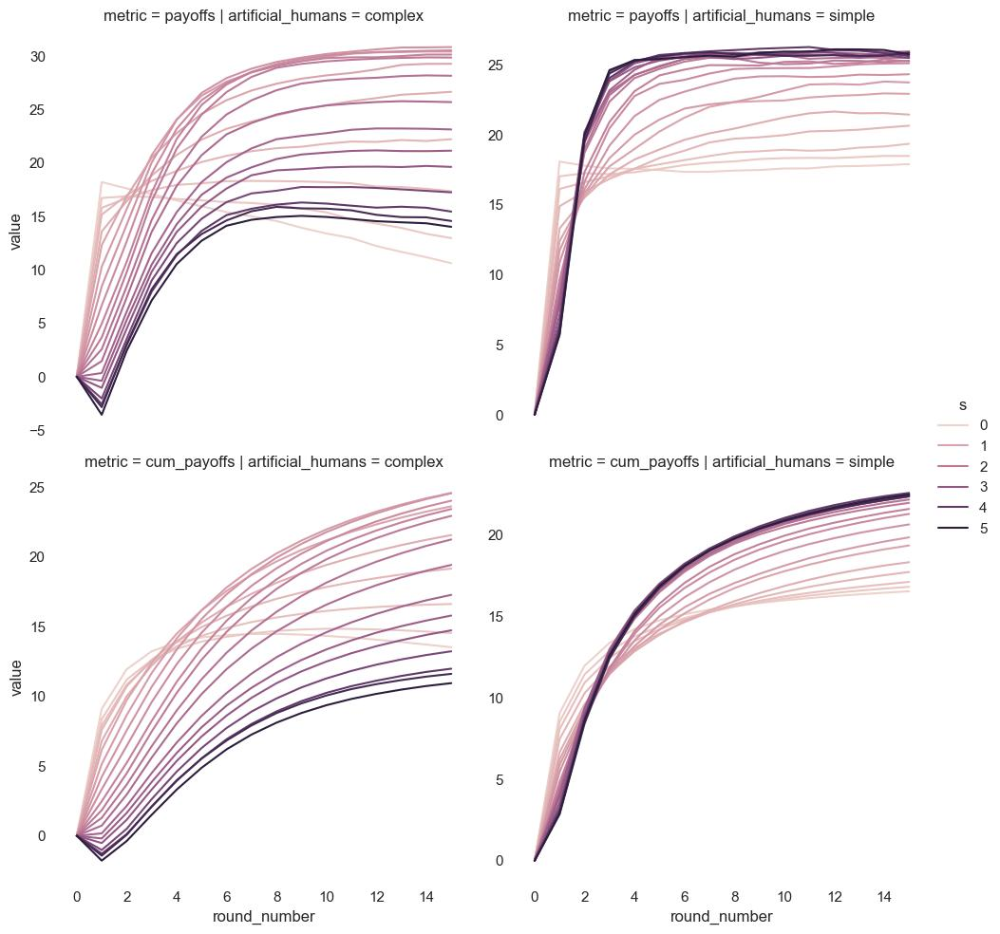

# Rule Based Manager

## Rule

We use the same rule, that we also utilized in pilot 2.
$pun = (20-cont) \cdot s + (cont != 20) \cdot  c - b$

However, unlike pilot 3 we generally keep the three factors $s$, $c$ and $b$
constant throughout an episode and also identically across the four agents.

## Importance of factors

We calculate the cumulative common good across all 16 rounds for a grid of
different factors $s$, $c$ and $b$. We also compare results for two different
artificial humans (complex and simple).

> The average common good over the full episode for different punishment slopes $c$ and binary
> punishment of any defectors $s$. We show
> results for complex and simple artificial humans on the left and right
> respectively.

> The average common good over the full episode for different punishment slopes
> $c$ and grace values $b$. We show
> results for complex and simple artificial humans on the left and right
> respectively.

### Conclusion

- Slope is the most important factor.
- Therefore we set in the following c == 0 and b == 0.
- A slope around 1.2 appears optimal for the complex AH.
- For simple AH there does not appear to a clear maximum.

## Evolution over the rounds

**Contribution and punishments over rounds**

> The evolution of contributions and punishments on the y-axis are depicted over
> 16 rounds on the x-axis.
> The left and right column depict complex and simple artificial humans
> respectively. We only vary the slope factor $s$. The other two factors, $c$
> and $b$ are set to zero.

**Common Good and Cumulative Common Good**

> We show in the first row the common good (averaged over multiple simulations).
> The second row depicts the cumulative average common good. Thereby, we
> calculate the average common good over the rounds up to the round indicated
> by the y-axis.
> The left and right column depict complex and simple artificial humans
> respectively. We only vary the slope factor $s$. The other two factors, $c$
> and $b$ are set to zero.

**Common Good and Cumulative Common Good**

> We show the manager reward in the first row and the cumulative manager reward
> in the second row. The reward in each round is corresponding to the common
> good of the
> The left and right column depict complex and simple artificial humans
> respectively. We only vary the slope factor $s$. The other two factors, $c$
> and $b$ are set to zero.

The complex and simple artificial humans lead to qualitatively different
evolution of contributions, punishments and consequently common good. For simple
AH are relative insensitive to very large punishment / contribution ratios $s$.
Also punishments do, surprisingly, not increase with larger $s$ in later rounds.
this surprising observation might be an effect of the punishment being caped at
30 and a punishment ration $s$ of, for instance 1.5 and 2, are therefore
indistinguishable for contribution of 0.

For both AH a punishment policy ($s > 0$) does lead to lower reduced common good
initially and only on the long run to a increase in the common good. For
instance a optimal policy of $s = 1.2$ (AH: complex) leads to a reduction of the
average common good of ~10 points. The reason for this is twofold. On the on
hand the cost punishments is entering directly in the current round, while the benefit from an increase of the
of on increased contribution as a result of the punishment is only entering in
the next round. On the other hand,

Cumulatively this
An optimal policy of $s = 1.2$ (AH: complex) and $s = 2$ (AH: simple) is only in
later rounds leading to an superior common good through higher contributions.

## Applying the rule only partially

### Apply the rule only to 1,2,3,4 agents

### Apply the rule only to some rounds - Total over episode

### Apply the rule only to some rounds - Per round

