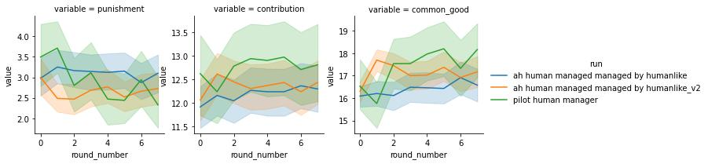
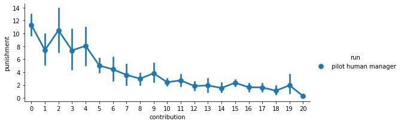
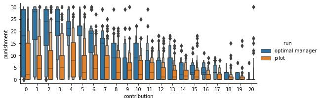

# Summary report

We trained two artificial manager and a model predicting human contributions.
First, we trained a neural network predicting the contributions of human participants in
the pilot study. We call this model the artificial human contributors (AHC).
Second, we trained an artificial human manager (AHM) that is predicting the punishment of a
human manager, given the group members contributions (and the historical context).
Finally, we trained an optimal manager (OM). The model was trained using deep Q by managing a
group of artificial humans contributors (AHC).

Following the established strategy of training neural networks, we provided the
model with the set of "raw" input features, i.e. a) contributions, b) punishments and c)
indicators of input a) and b) being valid (invalid entries originate throug
timeouts of participants in the pilot study). The neural network then learns
meaningful relationships from the data, without the experimentor having to design
relevant features. Our design choices was thus limited to the neural components
that made up the used neural architecture. We derived the architecture following
arguments of symmetry (i.e. permuations symmetry of the group members and
symmtery in time). We investigate the benefit of adding aggregated features such
as average contribution, average punishments and the common good to our model
and found no increase in predictive power in comparision to our best performing
model without these features.

For all 3 models, we used the same general architecture. We followed the
concept of on graph neural networks {} that describes a node model and an edge
model. We associate a contributor with a node and an edge
with the influence between contributors. As all contributors can see the
behavior of all other contributors, we compute directed edges between all nodes.
We include a recurrent unit into the node model to allow for temporal
relationships. The recurrent nature thereby allows, in theory, to learn
relationship accross the full sequence. That means, that a input in the first
round can, in principal, influence the behavior in the last round.

In the following table we
summarize the influence of the different components on the on the average (i.e. cross-validated or on
repreated RL runs) model performance. All architectures investigated involved the node model.

|                                     | artificial humans contributors | artificial human manager | optimal manager |
|-------------------------------------|--------------------------------|--------------------------|-----------------|
| edge model (social influence)       |               ++               |             +            |       (+)       |
| recurrent unit (temporal influence) |               ++               |             o            |        ++       |

*Artificial Human Contributors*

*Artificial Human Manager*

*Optimal Manager*

We might be able to conclude that:
1. Human contributions are dependend on contributions and
   punishments of the previous round. Allowing the model to include information
   from earlier rounds increases predictive accuracy. (effect size is moderate)
2. Human contributions are not in isolation to contributions and punishments of
   other group members. Instead, predictive accuracy is increasing when
   including this information. (effect size is moderate)
3. The current contribution and the last punishment seem to be sufficient when
   predicting punishment of human manager. Human manager do not seem to take into
   account long term behavior.
4. Human manager do take into account the contributions of other participants,
   when punishing a focal individual. (effect size is small)
5. The ability of the manager to consider the full history of previous
   contributions and punishments increases the performance of RL manager
   significantly. The manager might adopt to individuals, or just change the
   strategy over the rounds.
6. The ability to make the punishment dependent others then the focal individual
   increase the performance of the RL manager moderately.

## Comparing Aggregates

We investigated the behavior of artificial human contributors when managed by
the artificial human manager (blue) and when managed by the optimal manager
(orange). For comparision we also show human behaviour as collected in our pilots.

Our simulations of the artificial human manager (blue) well matches the corresponding
pilot with a human manager (green) in terms of average punishment, average contribution and
average common good. This suggest that our artificial human manager, on average, well
captures the behavior of human manager.

Our simulation with an optimal manager (orange) shows increased contribution
levels compared to the pilots (green, red) and the simulation with an
artificial human manager (red). The optimal manager punish higher initially, however
this also leads to rapidly increasing contributions. Thereby eventially the
common good of the optimal manager outperforms all other conditions.

## Comparing Strategy

Addtionally, we compared the empirical relationship between contributions and
punishments.

We plot the average punishment conditioned on the contribution of
the punished group member. Thereby, we visualize an empirical punishing
policy in respect to the contribution. The plots shows a close match between the
artificial human manager and actual human manager in the pilots. The rule based
manager is showing higher punishments accross all contribution
levels. The optimal manager shows relative high punishment for small defection
(i.e. a contributions of 17 points).
The punishment is only midly increasing from 17 points down to a contribution of 9 points. For
lower contributions the punishment is rapidly increasing to levels even
above 20 points. Thereby the punishments of the optimal manager are partially
distinctivly above the ones of all other manager.

## Coverage of the pilots

We also investigate the distribution of punishments conditioned on the
contributions of the group members. A comparision of the optimal manager and the
pilots shows, that for medium and high contributions, the
punishment levels shown by the optimal manager have been reasonably sampled in the pilot,
regardless of the average punishment being lower. In the regime of very low
contributions (i.e. below 5 points), however, the high punishments of the optimal manager
have seldom been used within the pilot. Correspondingly it is not
clear, how well the artificial human contributors are representing human
behavior in this regime.

