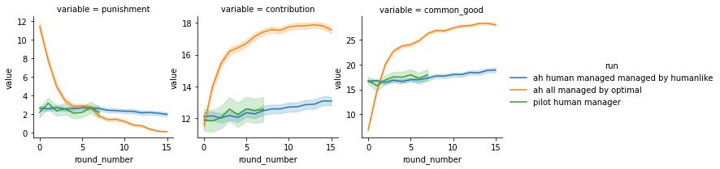
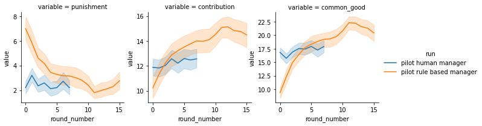

Hello everyone,
what a journey. Deep RL has been far from trivial. But I have now two artificial
manager. Let me give you a short overview of what is most
relevant. I will also link below more detailed reports.

# Summary report

We trained two artificial manager. The first model is the artificial human
manager (AHM). This model is a neural
network prediciting the punishment a human manger would make in a given situation.
The second model is the optimal manager (OM). This model was trained using deep Q
learning and is predicting the optimal punishment. It was trained by managing a
group of artificial humans contributors (AHC).
AHC are neural networks predicting the contributions a human would make in a
given situation.

We like to give a short overview of the architectures, that we have found as most
effective for each of the models. Then we will talk briefly about some of the
"machine behaviours" we found.

We will not go into the detail of the much bigger space of architectures that we
have investigated. Instead we like to focus on the design features most relevant from a
behavior science perspective.

A general remark first. In traditional machine learning, much of the practical
focus had to be put in the design of usefull input features. The hope of deep learning
is that very generic "raw" input features are sufficent. Designers, instead,
have to decide which neural connections to include. This allows argumentation
from first principles, like symmetry in time and permutation, and does not
require designing complicated aggregated features. In fact, the best model did
not improved when adding any of such features. We will therefore in the following
only report results of models with the most minimalistic inputs. The input
essentially were only composed of, a) contributions, b) punishments and c)
indicators of valid inputs for all contributors.

For all 3 models, we used the same general architecture. We followed the
litarature on graph neural networks. In the graph a node corresponds to on of
the group members and computes either its contribution or its punishment.

Successfull models were composed of a maximum of three components, a) a edge
model, b) a node model, and c) a recurrent unit.

The edge model can be understood as modeling the social influence of other
group member on a focal group member. It is applied to all pairs of nodes and
take the features of both nodes the influencing and the influenced one. The
final input to the focal node is then computed as the average over all
influencing edges.

The node model simply computes the impact of the input of that specific node on
the same nodes behavior (punishment or contribution).

The recurrent unit allows to learn temporal relationships in the behavior, i.e.
the influence of a previous punishment or contribution, on a future punishment
or contribution. The recurrent nature thereby allows, in theory, to learn
relationship accross the full sequence. That means, that a input in the first
round can, in principal, influence the behavior in the last round.

All architectures investigated involved the node model. In the following table we
summarize the architecture that showed on average (i.e. cross-validated or on
repreated RL runs) the highest performance.

|                                     | artificial humans contributors | artificial human manager | optimal manager |
|-------------------------------------|--------------------------------|--------------------------|-----------------|
| edge model (social influence)       |               +                |            ++            |         o       |
| recurrent unit (temporal influence) |               ++               |             o            |        ++       |
| ++: large impact   +: some impact   o: no impact |

We then investigated the behavior of AHM, when managing AHC and compared
this with the behavior of actual real group in the pilot.

We can make the following observations:
1. Punishment level of the AHM (blue, orange) matches that of the human manager (green).
2. Contribution of AHC managed by the AHM (blue) are slightly below the
   empirical contributions by actual human participants (violet).
   Correspondingly the common good is slightly lower.
3. However, when only the data from the pilot with a human manager is used to
   train the AHC (orange), then AHC is matching well with the empirical data (green).

We can therefore conclude. AHC seem to well represet human behavior. Human
behavior in the two pilots is slightly different (most likely due to difference
in the priming). Correspondingly, AHC are behaving slightly different, depending
on whether they are trained on the full dataset, or only on the subset of the
pilot data that included a human manager.

We also investigated the behavior of OM, when managing AHC.

We can observe that:
1. OM (blue, orange) is consistently outperforming the common good archieved in
   the pilots (green, red).
2. OM are punishing at much higher level initially, but at lower level
   eventually.
3. The performance of OM is robust, however reduced, when managing alternative
   AHC trained on a subset of the data (orange).

This results suggest, that the optimal manager is able (at least when paired
with AHC) to lead to higher contributions and correspondingly higher common
good, when compared to human manager.

Finally, we compared the empirical relationship between contributions and
punishments.

This the data shows, that the AHM is, on average, following the same policy then
the actual human manager in the experiment. The rule based manager, on average,
is somewhat stricter then then the human manager. Finally, the optimal manager
is, on average, much more stricter then any policy, in particular for relative
low levels of contributions.

Boxen plots comparing the behavior of the optimal manager and the managers in
the pilot. This comparison shows, that the optimal manager is showing an punishing
behavior that is clearly out the range sampled in the pilot studies. It is
therefore not clear if the AHC are well representing human reactions to such high
punishments.

