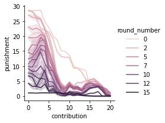
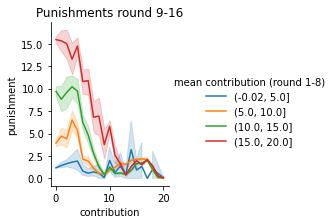

# Summary report

We trained two artificial managers and a model predicting human contributions.
First, we trained a neural network predicting the contributions of human participants in
the pilot study. We call this model the artificial human contributors (AHC).
Second, we trained an artificial human manager (AHM) that is predicting the punishment of a
human manager, given the group members' contributions (and the historical context).
Finally, we trained an optimal manager (OM). The model was trained using deep Q by managing a
group of artificial human contributors (AHC).

Following the established strategy of training neural networks, we provided the
model with the set of "raw" input features, i.e. a) contributions, b) punishments and c)
indicators of input a) and b) being valid (invalid entries originate through
timeouts of participants in the pilot study). The neural network then learns
meaningful relationships from the data, without the experimenter having to design
relevant features. Our design choices were thus limited to the neural components
that made up the used neural architecture. We derived the architecture following
arguments of symmetry (i.e. permutations symmetry of the group members and
symmetry in time). We investigate the benefit of adding aggregated features such
as average contribution, average punishments and the common good to our model
and found no increase in predictive power in comparison to our best-performing model without these features.

For all 3 models, we used the same general architecture. We followed the
concept of graph neural networks {} that describes a node model and an edge
model. We associate a contributor with a node and an edge
with the influence between contributors. As all contributors can see the
behavior of all other contributors, we compute directed edges between all nodes.
We include a recurrent unit in the node model to allow for temporal
relationships. The recurrent nature thereby allows, in theory, to learn relationships across the full sequence. That means that the first
round can, in principle, influence the behavior in the last round.

In the following table, we summarize the influence of the different components on the average (i.e. cross-validated or on
repeated RL runs) model performance. All architectures investigated involved the node model.

|                                     | artificial humans contributors | artificial human manager | optimal manager |
| ----------------------------------- | ------------------------------ | ------------------------ | --------------- |
| edge model (social influence)       | ++                             | +                        | (+)             |
| recurrent unit (temporal influence) | ++                             | o                        | ++              |

_Artificial Human Contributors_

_Artificial Human Manager_

_Optimal Manager_

We might be able to conclude that:

1. Human contributions are dependent on contributions and
   punishments of the previous round. Allowing the model to include information
   from earlier rounds increases predictive accuracy. (effect size is moderate)
2. Human contributions are not in isolation from contributions and punishments of
   other group members. Instead, predictive accuracy is increasing when
   including this information. (effect size is moderate)
3. The current contribution and the last punishment seem to be sufficient when predicting the punishment of human managers. Human managers do not seem to take into account long-term behavior.
   Human managers do take into account the contributions of other participants when punishing a focal individual. (effect size is small)
4. The ability of the manager to consider the full history of previous
   contributions and punishments increases the performance of the RL manager significantly. The manager might adapt to individuals, or just change the
   strategy over the rounds.
5. The ability to make the punishment dependent on others than the focal individual
   increase the performance of the RL manager moderately.

## Comparing Aggregates

We investigated the behavior of artificial human contributors when managed by
the artificial human manager (blue) and when managed by the optimal manager
(orange). For comparison, we also show human behavior as collected in our pilots.

Our simulations of the artificial human manager (blue) well match the corresponding
pilot with a human manager (green) in terms of average punishment, average contribution and the average common good. This suggests that our artificial human manager, on average, well
captures the behavior of a human manager.

Our simulation with an optimal manager (orange) shows increased contribution
levels compared to the pilots (green, red) and the simulation with an
artificial human manager (red). The optimal manager punishes higher initially, however
this also leads to rapidly increasing contributions. Thereby eventually the
common good of the optimal manager outperforms all other conditions.

## Comparing Strategy

Additionally, we compared the empirical relationship between contributions and
punishments.

We plot the average punishment conditioned on the contribution of
the punished group member. Thereby, we visualize an empirical punishing policy
conditioned on the contribution. The plots show a close match between the
artificial human manager and the real human manager in the pilots. The rule-based manager is showing higher punishments across all contribution
levels. The optimal manager shows relatively high punishment for small defection
(i.e. a contribution of 17 points).
The punishment is only mildly increasing from 17 points down to a contribution of 9 points. For lower contributions, the punishment is rapidly increasing to levels even
above 20 points. Thereby the punishments of the optimal manager are partially
distinctively above the ones of all other managers.

## Coverage of the pilots

We investigate the distribution of punishments conditioned on the
contributions of the group members. A comparison of the optimal manager and the
pilots shows, that for medium and high contributions, the
punishment levels shown by the optimal manager have been reasonably sampled in the pilot,
regardless of the average punishment being lower. In the regime of very low
contributions (i.e. below 5 points), however, the high punishments of the optimal manager
have seldom been used within the pilot. Correspondingly it is not
clear, how well the artificial human contributors are representing human
behavior in this regime.

## Behavior of RL manager

Further investigating the behavior of the RL manager, we found that the optimal manager is punishing in the first rounds significantly harsher than in later
rounds.

In the first three rounds punishment decrease roughly linearly with increasing
contributions. In later rounds punishment levels are bimodal. Punishments are
relatively high for contributions around 15 to 18 points. Punishments for
contributions from 7 to 14 points in comparisons are lower. Finally, for contributions below 7 points, punishments are increasing rapidly.

Additionally, we investigated the punishments in relation to the average
contribution of artificial humans. In particular, we group the data of the second
half of the experiment by the mean contribution in the first half.

We find, that the more a participant contributed on average in
the first half of the experiment, the more strictly the RL manager reacted to
defections in the second half.

We can conclude, that while apparently being effective, the RL manager is
showing behavior that might be described as unfair. In particular, the RL manager
is showing a) a non-Monotonic
relationship between contribution and punishment and b) a higher punishment of
participants that contributed more in the past. The RL manager's needs are
optimized on the marginal benefit of punishing.
Correspondingly, this behavior might be
efficient if the cost of punishment does not outweigh the potential benefit of
an increase in contribution. However, a) artificial humans might not
correctly model the possible feeling of being treated unfairly and b) such feeling
could lead to participants selecting a less efficient (but more fair) human
manager in the endogenous condition.
