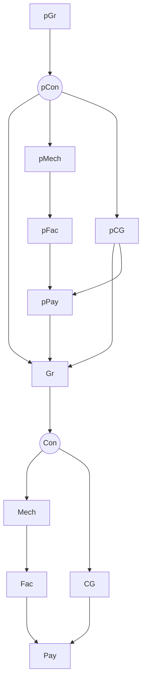
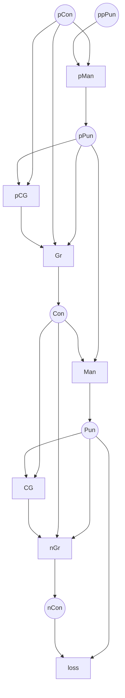
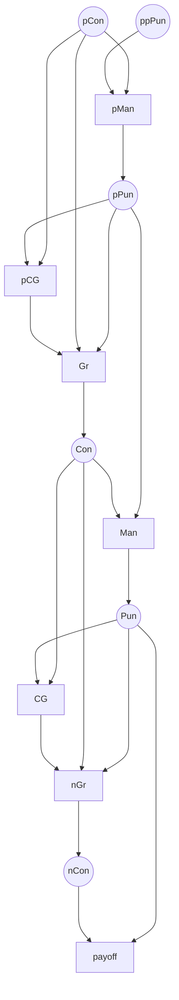

## Algorithmic Mechanism (Deepmind)

```mermaid
flowchart TD

pCG ---> Gr
pCon ---> Gr
pPay ---> Gr

Gr ---> Con((Con))

Mech ---> Fac
Con ---> Mech

Fac ---> Pay
CG ---> Pay

Con ---> CG


pGr ---> pCon((pCon))

pMech ---> pFac
pCon ---> pMech

pFac ---> pPay
pCG ---> pPay

pCon ---> pCG
```

## Ours

```mermaid
flowchart TD

ppPun((ppPun)) ---> pMan
pCon((pCon)) ---> pMan

pMan ---> pPun((pPun))

pPun ---> pCG
pCon ---> pCG

pCG ---> Gr
pCon((pCon)) ---> Gr
pPun((pPun)) ---> Gr

Gr ---> Con((Con))

Con ---> Man
pPun ---> Man

Man ---> Pun((Pun))

Pun ---> CG
Con ---> CG

CG ---> nGr
Con ---> nGr
Pun ---> nGr

nGr ---> nCon((nCon))

nCon ---> loss
Pun ---> loss
```

```mermaid
flowchart TD

ppPun((ppPun)) ---> pMan
pCon((pCon)) ---> pMan

pMan ---> pPun((pPun))

pPun ---> pCG
pCon ---> pCG

pCG ---> Gr
pCon((pCon)) ---> Gr
pPun((pPun)) ---> Gr

Gr ---> Con((Con))

Con ---> Man
pPun ---> Man

Man ---> Pun((Pun))

Pun ---> CG
Con ---> CG

CG ---> nGr
Con ---> nGr
Pun ---> nGr

nGr ---> nCon((nCon))

nCon ---> payoff
Pun ---> payoff
```
