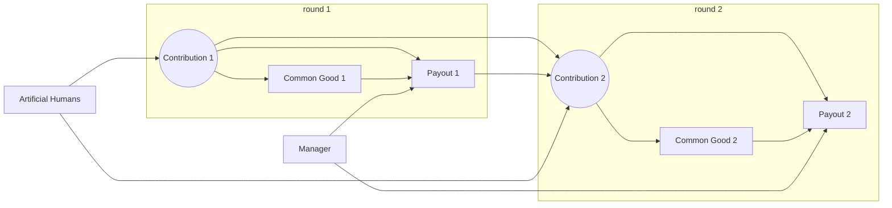
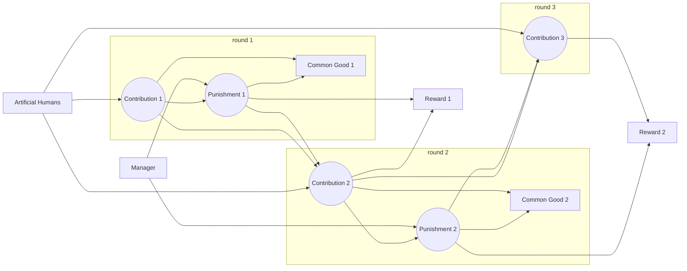
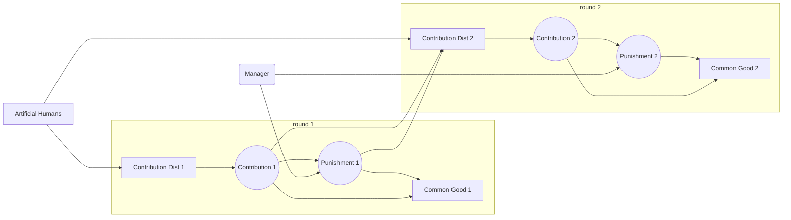

## Theirs

```mermaid
flowchart LR

AH[Artificial Humans]
M[Manager]

subgraph round 1
    P1
    C1
    CG1
end

subgraph round 2
    P2
    C2
    CG2
end

C1((Contribution 1))
C2((Contribution 2))

CG1[Common Good 1]
CG2[Common Good 2]

P1[Payout 1]
P2[Payout 2]

C1 ---> C2

C1 ---> P1
C2 ---> P2

C1 ---> CG1
C2 ---> CG2

P1 ---> C2

CG1 ---> P1
CG2 ---> P2


AH ---> C1
AH ---> C2

M ---> P1
M ---> P2

```

## Ours

```mermaid
flowchart LR

AH[Artificial Humans]
M[Manager]

subgraph round 1
    P1
    C1
    CG1
end

subgraph round 2
    P2
    C2
    CG2
end


subgraph round 3
    C3
end

P1((Punishment 1))
P2((Punishment 2))

C1((Contribution 1))
C2((Contribution 2))
C3((Contribution 3))

CG1[Common Good 1]
CG2[Common Good 2]

R1[Reward 1]
R2[Reward 2]


C1 ---> P1
C2 ---> P2

C1 ---> C2
C2 ---> C3

P1 ---> C2
P2 ---> C3

P1 ---> CG1
C1 ---> CG1
P2 ---> CG2
C2 ---> CG2

P1 ---> R1
C2 ---> R1

P2 ---> R2
C3 ---> R2

AH ---> C1
AH ---> C2
AH ---> C3

M ---> P1
M ---> P2

```

## Ours 2

```mermaid
flowchart LR

AH[Artificial Humans]
M(Manager)

subgraph round 1
    P1
    C1
    CG1
    CD1
end

subgraph round 2
    P2
    C2
    CG2
    CD2
end

P1((Punishment 1))
P2((Punishment 2))

C1((Contribution 1))
C2((Contribution 2))

CD1[Contribution Dist 1]
CD2[Contribution Dist 2]

CG1[Common Good 1]
CG2[Common Good 2]

C1 ---> P1
C1 ---> CD2
P1 ---> CD2
C2 ---> P2

P1 ---> CG1
C1 ---> CG1
P2 ---> CG2
C2 ---> CG2

AH ---> CD1
AH ---> CD2

CD1 ---> C1
CD2 ---> C2

M ---> P1
M ---> P2

```
